01-data_exploration
================
Compiled at 2025-05-29 17:20:27 UTC

``` r
here::i_am(paste0(params$name, ".Rmd"), uuid = "85d977d4-6a20-49dd-aa45-5d1eae842469")
```

The purpose of this document is to import CPI scores from each genetic
background. Filter experiments and normalize the data.

``` r
library(tidyverse)
```

    ## Warning: package 'ggplot2' was built under R version 4.3.2

    ## ── Attaching core tidyverse packages ──────────────────────── tidyverse 2.0.0 ──
    ## ✔ dplyr     1.1.2     ✔ readr     2.1.4
    ## ✔ forcats   1.0.0     ✔ stringr   1.5.0
    ## ✔ ggplot2   3.5.1     ✔ tibble    3.2.1
    ## ✔ lubridate 1.9.2     ✔ tidyr     1.3.0
    ## ✔ purrr     1.0.2     
    ## ── Conflicts ────────────────────────────────────────── tidyverse_conflicts() ──
    ## ✖ dplyr::filter() masks stats::filter()
    ## ✖ dplyr::lag()    masks stats::lag()
    ## ℹ Use the conflicted package (<http://conflicted.r-lib.org/>) to force all conflicts to become errors

``` r
# create or *empty* the target directory, used to write this file's data: 
projthis::proj_create_dir_target(params$name, clean = TRUE)

# function to get path to target directory: path_target("sample.csv")
path_target <- projthis::proj_path_target(params$name)

# function to get path to previous data: path_source("00-import", "sample.csv")
path_source <- projthis::proj_path_source(params$name)
```

# Read files

First I will read each file for each genotype individually.

``` r
# Wild-type.
wt_scores <- read.csv(path_source("00-import", "Scores_WT.txt"), sep='\t')
colnames(wt_scores) <- paste0("WT_", colnames(wt_scores))

wt_scores <- wt_scores %>% 
  
  # Make chemicals a named column
  rownames_to_column("chem_conc")

# marA deletion
dmara_scores <- read.csv(path_source("00-import","Scores_dmarA.txt"), sep='\t') %>% 
  rownames_to_column("chem_conc") 

# rob deletion
drob_scores <- read.csv(path_source("00-import", "Scores_drob.txt"), sep='\t') %>% 
  rownames_to_column("chem_conc") 

# soxS deletion 
dsoxs_scores <- read.csv(path_source("00-import", "Scores_dsoxS.txt"), sep='\t') %>% 
  rownames_to_column("chem_conc")
```

# Data Summaries

## Wildtype

We start to get an idea of what our data looks like if we just look at
the WildType

``` r
summary_str <- function(df){
  
  # Number of chemicals
  n_chems <- df %>% 
  mutate(chem_name = str_sub(chem_conc, start = 1, end = -2)) %>% 
  select(chem_name) %>% 
  n_distinct()
  
  # Number of concentrations
  n_concentrations <- df %>% 
    mutate(concentration = str_sub(chem_conc, start = -1)) %>% 
    select(concentration) %>% 
    n_distinct()
  
  # Number of total strains
  n_strains <- df %>% 
    select(-c(chem_conc)) %>% 
    ncol
  
  # Number of experiments
  n_experiments <- n_strains * n_chems * n_concentrations
  
  # Number of unique genes
  unique_genes <- unique(str_remove(colnames(df %>% select(-c(chem_conc))), "_\\d"))
  n_unique_genes <- length(unique_genes)

  
  sumstr <- paste("In this experiment there are\n\t", 
        n_chems, "chemicals tested at\n\t", 
        n_concentrations, "concentrations screened against\n\t",
        n_strains, "strains consisting of \n\t",
        n_unique_genes, "unique genes for which there are two replicates. This means a total of\n\t",
        n_experiments, "different assays were conducted")
  
  return(sumstr)
}
```

WT info

``` r
cat(summary_str(wt_scores))
```

    ## In this experiment there are
    ##   96 chemicals tested at
    ##   4 concentrations screened against
    ##   16 strains consisting of 
    ##   8 unique genes for which there are two replicates. This means a total of
    ##   6144 different assays were conducted

We can also take a look at the table itself

``` r
head(wt_scores)
```

    ##            chem_conc    WT_EVC_1   WT_EVC_2 WT_pacrAB_1 WT_pacrAB_2
    ## 1 1-Methyluric acid1   -2.803554   2.803554 -129.188360   -52.03733
    ## 2 1-Methyluric acid2   56.932280 -56.932280 -295.185644   -82.87755
    ## 3 1-Methyluric acid3   60.734460 -60.734460    1.289335   -33.59610
    ## 4 1-Methyluric acid4   18.672382 -18.672382  -32.546467  -227.42593
    ## 5     2-2-Bipyridyl1          NA         NA          NA          NA
    ## 6     2-2-Bipyridyl2 -103.230289 103.230289 -489.079624  -195.52868
    ##   WT_pmarRAB_1 WT_pmarRAB_2 WT_pmicF_1 WT_pmicF_2 WT_pompF_1  WT_pompF_2
    ## 1    -651.1527  -1052.17348  -313.1530  -559.1256   1056.732   1409.7382
    ## 2   -1145.1820    366.37026  -172.7639  -244.4424  -1935.526  -4960.3436
    ## 3     277.6685   -951.01622   589.9631  -377.9414   4442.800    195.8303
    ## 4     110.7738    -13.77868  -590.9882   469.2758   3990.197   1127.8632
    ## 5           NA           NA         NA         NA         NA          NA
    ## 6    3655.7729   5451.05374  9569.1110 12584.6873 -15206.936 -11588.0978
    ##    WT_prob_1  WT_prob_2 WT_psoxS_1 WT_psoxS_2 WT_ptolC_1 WT_ptolC_2
    ## 1 -112.55006  150.43992  -348.0095  1047.2628   5.589651 121.813066
    ## 2 -155.22019  -79.73974   650.8023   806.3052   8.482050  43.264214
    ## 3   73.42965   39.15036   861.0775   829.6490  68.396398   6.626961
    ## 4   51.00787 -282.16223  1111.6016   601.8396  36.924399 -57.524101
    ## 5         NA         NA         NA         NA         NA         NA
    ## 6 -541.23529   22.31366 -6146.7999 -6195.6770 -86.939238 -58.298704

Let’s take a look a the other experiments

## Pertubation Exploration

dmarA summary

``` r
cat(summary_str(dmara_scores))
```

    ## In this experiment there are
    ##   96 chemicals tested at
    ##   4 concentrations screened against
    ##   16 strains consisting of 
    ##   8 unique genes for which there are two replicates. This means a total of
    ##   6144 different assays were conducted

drob summary

``` r
cat(summary_str(drob_scores))
```

    ## In this experiment there are
    ##   96 chemicals tested at
    ##   4 concentrations screened against
    ##   16 strains consisting of 
    ##   8 unique genes for which there are two replicates. This means a total of
    ##   6144 different assays were conducted

dsoxs summary

``` r
cat(summary_str(dsoxs_scores))
```

    ## In this experiment there are
    ##   96 chemicals tested at
    ##   4 concentrations screened against
    ##   16 strains consisting of 
    ##   8 unique genes for which there are two replicates. This means a total of
    ##   6144 different assays were conducted

# Failed experiments

As expected, there will be some compound-concentration combinations
where the rows are all NAs. This is mainly due to a high concentration
of antibiotics. Let’s try to detect those.

``` r
number_nas <- function(df){
  
  # Get number of NAs per chem-conc combination
  na_info <- df %>% 
  
    # Transpose chemicals to columns
    column_to_rownames("chem_conc") %>% 
    t() %>% 
    as.data.frame() %>% 
    
    # Count number of NAs by column
    summarise_all(~ sum(is.na(.))) %>% 
    t() %>% 
    as.data.frame() %>% 
    
    # Format for joining
    rownames_to_column("chem_conc") %>% 
    rename("n_NAs" = "V1")
  
  
  df_with_na <- df %>% 
    left_join(na_info, by="chem_conc")
  
  return(df_with_na)
  
}

wt_scores <- number_nas(wt_scores)
dmara_scores <- number_nas(dmara_scores)
drob_scores <- number_nas(drob_scores)
dsoxs_scores <- number_nas(dsoxs_scores)
```

Let’s see how many compounds failed completely, and whether they
consistenly fail across all genotypes.

``` r
N_STRAINS <- 16

failed_list <- list("WT" = wt_scores %>% dplyr::filter(n_NAs == N_STRAINS) %>% select(chem_conc) %>% unlist(),
                    "dmarA" = dmara_scores %>% dplyr::filter(n_NAs == N_STRAINS) %>% select(chem_conc) %>% unlist(),
                    "drob" = drob_scores %>% dplyr::filter(n_NAs == N_STRAINS) %>% select(chem_conc) %>% unlist(),
                    "dsoxs" = dsoxs_scores %>% dplyr::filter(n_NAs == N_STRAINS) %>% select(chem_conc) %>% unlist())

UpSetR::upset(UpSetR::fromList(failed_list))
```

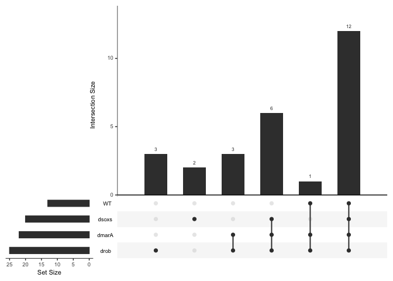<!-- -->

The majority of failed experiments are failing in at least three of the
screens.

# Partial Failure

In the previous section, we looked at compound-concentration
combinations that fail across all strains. Now lets look at combinations
that only partially fail.

``` r
partial_failure_counts <- function(df, genotype_str){
  
  df %>% 
  count(n_NAs) %>% 
  dplyr::filter(n_NAs > 0) %>% 
  mutate(genotype = genotype_str)
  
}


partial_failure_long <- bind_rows(partial_failure_counts(wt_scores, "WT"),
                                  partial_failure_counts(dmara_scores, "dmarA"),
                                  partial_failure_counts(drob_scores, "drob"),
                                  partial_failure_counts(dsoxs_scores, "dsoxS"))


partial_failure_long %>% 
  pivot_wider(id_cols = n_NAs, names_from = genotype, values_from = n, values_fill = 0) %>% 
  dplyr::arrange(n_NAs)
```

    ## # A tibble: 13 × 5
    ##    n_NAs    WT dmarA  drob dsoxS
    ##    <int> <int> <int> <int> <int>
    ##  1     1     5     3     1     6
    ##  2     2     2     1     4     3
    ##  3     3     0     4     3     1
    ##  4     4     0     2     1     1
    ##  5     5     3     1     2     3
    ##  6     6     1     0     3     1
    ##  7     7     0     1     1     4
    ##  8     8     2     0     1     0
    ##  9     9     1     2     1     0
    ## 10    10     0     0     1     1
    ## 11    11     2     1     0     0
    ## 12    12     0     0     0     3
    ## 13    16    13    22    25    20

``` r
complete_data <- wt_scores %>% 
  select(-n_NAs) %>% 
  left_join(dmara_scores %>% select(-n_NAs), by="chem_conc") %>%
  left_join(drob_scores %>% select(-n_NAs), by="chem_conc") %>% 
  left_join(dsoxs_scores %>% select(-n_NAs), by="chem_conc")


total_rows <- nrow(complete_data)
complete_failure_removal <- nrow(complete_data %>% dplyr::filter(!chem_conc %in% unlist(failed_list)))


complete_data_nacount <- number_nas(complete_data)
any_failure_removal <- nrow(complete_data_nacount %>% dplyr::filter(n_NAs == 0))


summary_removal <- paste("There are", total_rows, "total chemical - concentration combinations\n\t", 
      total_rows-complete_failure_removal, "are removed due to complete failure (", complete_failure_removal, "remain)\n\t",
      total_rows-any_failure_removal, "are removed due to partial or complete failure (", any_failure_removal, "remain)")

cat(summary_removal)
```

    ## There are 384 total chemical - concentration combinations
    ##   27 are removed due to complete failure ( 357 remain)
    ##   49 are removed due to partial or complete failure ( 335 remain)

Remove chemical-concentration combinations that cause *any* measurement
to fail.

``` r
complete_scores <- complete_data_nacount %>% 
  dplyr::filter(n_NAs == 0) %>% 
  select(-n_NAs)
```

``` r
complete_scores.long <- complete_scores %>% 
  pivot_longer(cols=c(-chem_conc), names_to = "genotype_promoter_rep") %>% 
  separate(genotype_promoter_rep, into = c("genotype", "promoter", "replicate"), remove = FALSE, sep="_") %>% 
  
  mutate(chem_name = str_sub(chem_conc, start = 1, end = -2),
         concentration = str_sub(chem_conc, start = -1),
         promoter_rep = paste(promoter, replicate, sep="_"))
```

# Score distribution

## Scores by Promoter and Genotype

``` r
g <- complete_scores.long %>% 
  mutate(genotype_rep = paste(genotype, replicate, sep="_"),
         genotype_rep = factor(genotype_rep, levels = c("dsoxS_2", "dsoxS_1", 
                                                        "drob_2", "drob_1",
                                                        "dmarA_2", "dmarA_1",
                                                        "WT_2", "WT_1")),
         
         promoter = case_when(promoter == "EVC" ~ "EVC",
                              promoter == "pacrAB" ~ "acrABp",
                              promoter == "pmicF" ~ "micFp",
                              promoter == "pmarRAB" ~ "marRABp",
                              promoter == "pompF" ~ "ompFp",
                              promoter == "psoxS" ~ "soxSp",
                              promoter == "prob" ~ "robp",
                              promoter == "ptolC" ~ "tolCp"),
         
         promoter = factor(promoter, levels = c("EVC", "acrABp", "marRABp", "micFp",
                                                "ompFp", "robp", "soxSp", "tolCp"))) %>% 
  
  ggplot(aes(x=value, y=genotype_rep, fill=genotype)) +
  geom_violin() +
  geom_boxplot(width=0.2, fill="white", outlier.size=1) +
  
  facet_wrap(~promoter, ncol=4, scales = "free_x") +
  
  scale_y_discrete(labels = c("\u0394soxS_2", "\u0394soxS_1", 
                                "\u0394rob_2", "\u0394rob_1",
                                "\u0394marA_2", "\u0394marA_1",
                                "WT_2", "WT_1")) +
  
  scale_fill_manual(values = c("WT" = "#a2a39f", "dmarA" = "#ec9370", "drob" = "#48aa7d", "dsoxS" = "#556c9a")) +
  
  theme_bw() +
  theme(legend.position = "none",
        text = element_text(size=7),
        axis.text = element_text(size=6)) +
  labs(x="CPI Score", y="Strain - Replicate")
g
```

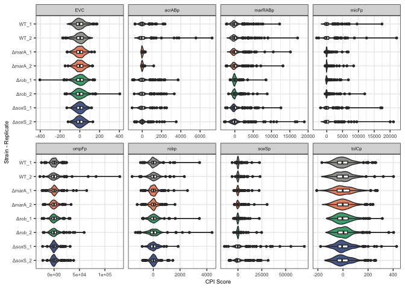

``` r
ggsave(path_target("score_distribution.png"), plot = g, dpi=300, width = 16, height = 8, units = "cm")

ggsave(path_target("score_distribution.pdf"), plot = g, dpi=300, width = 16, height = 8, units = "cm")
```

    ## Warning in grid.Call(C_textBounds, as.graphicsAnnot(x$label), x$x, x$y, :
    ## conversion failure on 'ΔsoxS_2' in 'mbcsToSbcs': dot substituted for <ce>

    ## Warning in grid.Call(C_textBounds, as.graphicsAnnot(x$label), x$x, x$y, :
    ## conversion failure on 'ΔsoxS_2' in 'mbcsToSbcs': dot substituted for <94>

    ## Warning in grid.Call(C_textBounds, as.graphicsAnnot(x$label), x$x, x$y, :
    ## conversion failure on 'ΔsoxS_1' in 'mbcsToSbcs': dot substituted for <ce>

    ## Warning in grid.Call(C_textBounds, as.graphicsAnnot(x$label), x$x, x$y, :
    ## conversion failure on 'ΔsoxS_1' in 'mbcsToSbcs': dot substituted for <94>

    ## Warning in grid.Call(C_textBounds, as.graphicsAnnot(x$label), x$x, x$y, :
    ## conversion failure on 'Δrob_2' in 'mbcsToSbcs': dot substituted for <ce>

    ## Warning in grid.Call(C_textBounds, as.graphicsAnnot(x$label), x$x, x$y, :
    ## conversion failure on 'Δrob_2' in 'mbcsToSbcs': dot substituted for <94>

    ## Warning in grid.Call(C_textBounds, as.graphicsAnnot(x$label), x$x, x$y, :
    ## conversion failure on 'Δrob_1' in 'mbcsToSbcs': dot substituted for <ce>

    ## Warning in grid.Call(C_textBounds, as.graphicsAnnot(x$label), x$x, x$y, :
    ## conversion failure on 'Δrob_1' in 'mbcsToSbcs': dot substituted for <94>

    ## Warning in grid.Call(C_textBounds, as.graphicsAnnot(x$label), x$x, x$y, :
    ## conversion failure on 'ΔmarA_2' in 'mbcsToSbcs': dot substituted for <ce>

    ## Warning in grid.Call(C_textBounds, as.graphicsAnnot(x$label), x$x, x$y, :
    ## conversion failure on 'ΔmarA_2' in 'mbcsToSbcs': dot substituted for <94>

    ## Warning in grid.Call(C_textBounds, as.graphicsAnnot(x$label), x$x, x$y, :
    ## conversion failure on 'ΔmarA_1' in 'mbcsToSbcs': dot substituted for <ce>

    ## Warning in grid.Call(C_textBounds, as.graphicsAnnot(x$label), x$x, x$y, :
    ## conversion failure on 'ΔmarA_1' in 'mbcsToSbcs': dot substituted for <94>

    ## Warning in grid.Call(C_textBounds, as.graphicsAnnot(x$label), x$x, x$y, :
    ## conversion failure on 'ΔsoxS_2' in 'mbcsToSbcs': dot substituted for <ce>

    ## Warning in grid.Call(C_textBounds, as.graphicsAnnot(x$label), x$x, x$y, :
    ## conversion failure on 'ΔsoxS_2' in 'mbcsToSbcs': dot substituted for <94>

    ## Warning in grid.Call(C_textBounds, as.graphicsAnnot(x$label), x$x, x$y, :
    ## conversion failure on 'ΔsoxS_1' in 'mbcsToSbcs': dot substituted for <ce>

    ## Warning in grid.Call(C_textBounds, as.graphicsAnnot(x$label), x$x, x$y, :
    ## conversion failure on 'ΔsoxS_1' in 'mbcsToSbcs': dot substituted for <94>

    ## Warning in grid.Call(C_textBounds, as.graphicsAnnot(x$label), x$x, x$y, :
    ## conversion failure on 'Δrob_2' in 'mbcsToSbcs': dot substituted for <ce>

    ## Warning in grid.Call(C_textBounds, as.graphicsAnnot(x$label), x$x, x$y, :
    ## conversion failure on 'Δrob_2' in 'mbcsToSbcs': dot substituted for <94>

    ## Warning in grid.Call(C_textBounds, as.graphicsAnnot(x$label), x$x, x$y, :
    ## conversion failure on 'Δrob_1' in 'mbcsToSbcs': dot substituted for <ce>

    ## Warning in grid.Call(C_textBounds, as.graphicsAnnot(x$label), x$x, x$y, :
    ## conversion failure on 'Δrob_1' in 'mbcsToSbcs': dot substituted for <94>

    ## Warning in grid.Call(C_textBounds, as.graphicsAnnot(x$label), x$x, x$y, :
    ## conversion failure on 'ΔmarA_2' in 'mbcsToSbcs': dot substituted for <ce>

    ## Warning in grid.Call(C_textBounds, as.graphicsAnnot(x$label), x$x, x$y, :
    ## conversion failure on 'ΔmarA_2' in 'mbcsToSbcs': dot substituted for <94>

    ## Warning in grid.Call(C_textBounds, as.graphicsAnnot(x$label), x$x, x$y, :
    ## conversion failure on 'ΔmarA_1' in 'mbcsToSbcs': dot substituted for <ce>

    ## Warning in grid.Call(C_textBounds, as.graphicsAnnot(x$label), x$x, x$y, :
    ## conversion failure on 'ΔmarA_1' in 'mbcsToSbcs': dot substituted for <94>

    ## Warning in grid.Call(C_textBounds, as.graphicsAnnot(x$label), x$x, x$y, :
    ## conversion failure on 'ΔsoxS_2' in 'mbcsToSbcs': dot substituted for <ce>

    ## Warning in grid.Call(C_textBounds, as.graphicsAnnot(x$label), x$x, x$y, :
    ## conversion failure on 'ΔsoxS_2' in 'mbcsToSbcs': dot substituted for <94>

    ## Warning in grid.Call(C_textBounds, as.graphicsAnnot(x$label), x$x, x$y, :
    ## conversion failure on 'ΔsoxS_1' in 'mbcsToSbcs': dot substituted for <ce>

    ## Warning in grid.Call(C_textBounds, as.graphicsAnnot(x$label), x$x, x$y, :
    ## conversion failure on 'ΔsoxS_1' in 'mbcsToSbcs': dot substituted for <94>

    ## Warning in grid.Call(C_textBounds, as.graphicsAnnot(x$label), x$x, x$y, :
    ## conversion failure on 'Δrob_2' in 'mbcsToSbcs': dot substituted for <ce>

    ## Warning in grid.Call(C_textBounds, as.graphicsAnnot(x$label), x$x, x$y, :
    ## conversion failure on 'Δrob_2' in 'mbcsToSbcs': dot substituted for <94>

    ## Warning in grid.Call(C_textBounds, as.graphicsAnnot(x$label), x$x, x$y, :
    ## conversion failure on 'Δrob_1' in 'mbcsToSbcs': dot substituted for <ce>

    ## Warning in grid.Call(C_textBounds, as.graphicsAnnot(x$label), x$x, x$y, :
    ## conversion failure on 'Δrob_1' in 'mbcsToSbcs': dot substituted for <94>

    ## Warning in grid.Call(C_textBounds, as.graphicsAnnot(x$label), x$x, x$y, :
    ## conversion failure on 'ΔmarA_2' in 'mbcsToSbcs': dot substituted for <ce>

    ## Warning in grid.Call(C_textBounds, as.graphicsAnnot(x$label), x$x, x$y, :
    ## conversion failure on 'ΔmarA_2' in 'mbcsToSbcs': dot substituted for <94>

    ## Warning in grid.Call(C_textBounds, as.graphicsAnnot(x$label), x$x, x$y, :
    ## conversion failure on 'ΔmarA_1' in 'mbcsToSbcs': dot substituted for <ce>

    ## Warning in grid.Call(C_textBounds, as.graphicsAnnot(x$label), x$x, x$y, :
    ## conversion failure on 'ΔmarA_1' in 'mbcsToSbcs': dot substituted for <94>

    ## Warning in grid.Call(C_textBounds, as.graphicsAnnot(x$label), x$x, x$y, :
    ## conversion failure on 'ΔsoxS_2' in 'mbcsToSbcs': dot substituted for <ce>

    ## Warning in grid.Call(C_textBounds, as.graphicsAnnot(x$label), x$x, x$y, :
    ## conversion failure on 'ΔsoxS_2' in 'mbcsToSbcs': dot substituted for <94>

    ## Warning in grid.Call(C_textBounds, as.graphicsAnnot(x$label), x$x, x$y, :
    ## conversion failure on 'ΔsoxS_1' in 'mbcsToSbcs': dot substituted for <ce>

    ## Warning in grid.Call(C_textBounds, as.graphicsAnnot(x$label), x$x, x$y, :
    ## conversion failure on 'ΔsoxS_1' in 'mbcsToSbcs': dot substituted for <94>

    ## Warning in grid.Call(C_textBounds, as.graphicsAnnot(x$label), x$x, x$y, :
    ## conversion failure on 'Δrob_2' in 'mbcsToSbcs': dot substituted for <ce>

    ## Warning in grid.Call(C_textBounds, as.graphicsAnnot(x$label), x$x, x$y, :
    ## conversion failure on 'Δrob_2' in 'mbcsToSbcs': dot substituted for <94>

    ## Warning in grid.Call(C_textBounds, as.graphicsAnnot(x$label), x$x, x$y, :
    ## conversion failure on 'Δrob_1' in 'mbcsToSbcs': dot substituted for <ce>

    ## Warning in grid.Call(C_textBounds, as.graphicsAnnot(x$label), x$x, x$y, :
    ## conversion failure on 'Δrob_1' in 'mbcsToSbcs': dot substituted for <94>

    ## Warning in grid.Call(C_textBounds, as.graphicsAnnot(x$label), x$x, x$y, :
    ## conversion failure on 'ΔmarA_2' in 'mbcsToSbcs': dot substituted for <ce>

    ## Warning in grid.Call(C_textBounds, as.graphicsAnnot(x$label), x$x, x$y, :
    ## conversion failure on 'ΔmarA_2' in 'mbcsToSbcs': dot substituted for <94>

    ## Warning in grid.Call(C_textBounds, as.graphicsAnnot(x$label), x$x, x$y, :
    ## conversion failure on 'ΔmarA_1' in 'mbcsToSbcs': dot substituted for <ce>

    ## Warning in grid.Call(C_textBounds, as.graphicsAnnot(x$label), x$x, x$y, :
    ## conversion failure on 'ΔmarA_1' in 'mbcsToSbcs': dot substituted for <94>

    ## Warning in grid.Call(C_textBounds, as.graphicsAnnot(x$label), x$x, x$y, :
    ## conversion failure on 'ΔsoxS_2' in 'mbcsToSbcs': dot substituted for <ce>

    ## Warning in grid.Call(C_textBounds, as.graphicsAnnot(x$label), x$x, x$y, :
    ## conversion failure on 'ΔsoxS_2' in 'mbcsToSbcs': dot substituted for <94>

    ## Warning in grid.Call(C_textBounds, as.graphicsAnnot(x$label), x$x, x$y, :
    ## conversion failure on 'ΔsoxS_1' in 'mbcsToSbcs': dot substituted for <ce>

    ## Warning in grid.Call(C_textBounds, as.graphicsAnnot(x$label), x$x, x$y, :
    ## conversion failure on 'ΔsoxS_1' in 'mbcsToSbcs': dot substituted for <94>

    ## Warning in grid.Call(C_textBounds, as.graphicsAnnot(x$label), x$x, x$y, :
    ## conversion failure on 'Δrob_2' in 'mbcsToSbcs': dot substituted for <ce>

    ## Warning in grid.Call(C_textBounds, as.graphicsAnnot(x$label), x$x, x$y, :
    ## conversion failure on 'Δrob_2' in 'mbcsToSbcs': dot substituted for <94>

    ## Warning in grid.Call(C_textBounds, as.graphicsAnnot(x$label), x$x, x$y, :
    ## conversion failure on 'Δrob_1' in 'mbcsToSbcs': dot substituted for <ce>

    ## Warning in grid.Call(C_textBounds, as.graphicsAnnot(x$label), x$x, x$y, :
    ## conversion failure on 'Δrob_1' in 'mbcsToSbcs': dot substituted for <94>

    ## Warning in grid.Call(C_textBounds, as.graphicsAnnot(x$label), x$x, x$y, :
    ## conversion failure on 'ΔmarA_2' in 'mbcsToSbcs': dot substituted for <ce>

    ## Warning in grid.Call(C_textBounds, as.graphicsAnnot(x$label), x$x, x$y, :
    ## conversion failure on 'ΔmarA_2' in 'mbcsToSbcs': dot substituted for <94>

    ## Warning in grid.Call(C_textBounds, as.graphicsAnnot(x$label), x$x, x$y, :
    ## conversion failure on 'ΔmarA_1' in 'mbcsToSbcs': dot substituted for <ce>

    ## Warning in grid.Call(C_textBounds, as.graphicsAnnot(x$label), x$x, x$y, :
    ## conversion failure on 'ΔmarA_1' in 'mbcsToSbcs': dot substituted for <94>

    ## Warning in grid.Call(C_textBounds, as.graphicsAnnot(x$label), x$x, x$y, :
    ## conversion failure on 'ΔsoxS_2' in 'mbcsToSbcs': dot substituted for <ce>

    ## Warning in grid.Call(C_textBounds, as.graphicsAnnot(x$label), x$x, x$y, :
    ## conversion failure on 'ΔsoxS_2' in 'mbcsToSbcs': dot substituted for <94>

    ## Warning in grid.Call(C_textBounds, as.graphicsAnnot(x$label), x$x, x$y, :
    ## conversion failure on 'ΔsoxS_1' in 'mbcsToSbcs': dot substituted for <ce>

    ## Warning in grid.Call(C_textBounds, as.graphicsAnnot(x$label), x$x, x$y, :
    ## conversion failure on 'ΔsoxS_1' in 'mbcsToSbcs': dot substituted for <94>

    ## Warning in grid.Call(C_textBounds, as.graphicsAnnot(x$label), x$x, x$y, :
    ## conversion failure on 'Δrob_2' in 'mbcsToSbcs': dot substituted for <ce>

    ## Warning in grid.Call(C_textBounds, as.graphicsAnnot(x$label), x$x, x$y, :
    ## conversion failure on 'Δrob_2' in 'mbcsToSbcs': dot substituted for <94>

    ## Warning in grid.Call(C_textBounds, as.graphicsAnnot(x$label), x$x, x$y, :
    ## conversion failure on 'Δrob_1' in 'mbcsToSbcs': dot substituted for <ce>

    ## Warning in grid.Call(C_textBounds, as.graphicsAnnot(x$label), x$x, x$y, :
    ## conversion failure on 'Δrob_1' in 'mbcsToSbcs': dot substituted for <94>

    ## Warning in grid.Call(C_textBounds, as.graphicsAnnot(x$label), x$x, x$y, :
    ## conversion failure on 'ΔmarA_2' in 'mbcsToSbcs': dot substituted for <ce>

    ## Warning in grid.Call(C_textBounds, as.graphicsAnnot(x$label), x$x, x$y, :
    ## conversion failure on 'ΔmarA_2' in 'mbcsToSbcs': dot substituted for <94>

    ## Warning in grid.Call(C_textBounds, as.graphicsAnnot(x$label), x$x, x$y, :
    ## conversion failure on 'ΔmarA_1' in 'mbcsToSbcs': dot substituted for <ce>

    ## Warning in grid.Call(C_textBounds, as.graphicsAnnot(x$label), x$x, x$y, :
    ## conversion failure on 'ΔmarA_1' in 'mbcsToSbcs': dot substituted for <94>

    ## Warning in grid.Call(C_textBounds, as.graphicsAnnot(x$label), x$x, x$y, :
    ## conversion failure on 'ΔsoxS_2' in 'mbcsToSbcs': dot substituted for <ce>

    ## Warning in grid.Call(C_textBounds, as.graphicsAnnot(x$label), x$x, x$y, :
    ## conversion failure on 'ΔsoxS_2' in 'mbcsToSbcs': dot substituted for <94>

    ## Warning in grid.Call(C_textBounds, as.graphicsAnnot(x$label), x$x, x$y, :
    ## conversion failure on 'ΔsoxS_1' in 'mbcsToSbcs': dot substituted for <ce>

    ## Warning in grid.Call(C_textBounds, as.graphicsAnnot(x$label), x$x, x$y, :
    ## conversion failure on 'ΔsoxS_1' in 'mbcsToSbcs': dot substituted for <94>

    ## Warning in grid.Call(C_textBounds, as.graphicsAnnot(x$label), x$x, x$y, :
    ## conversion failure on 'Δrob_2' in 'mbcsToSbcs': dot substituted for <ce>

    ## Warning in grid.Call(C_textBounds, as.graphicsAnnot(x$label), x$x, x$y, :
    ## conversion failure on 'Δrob_2' in 'mbcsToSbcs': dot substituted for <94>

    ## Warning in grid.Call(C_textBounds, as.graphicsAnnot(x$label), x$x, x$y, :
    ## conversion failure on 'Δrob_1' in 'mbcsToSbcs': dot substituted for <ce>

    ## Warning in grid.Call(C_textBounds, as.graphicsAnnot(x$label), x$x, x$y, :
    ## conversion failure on 'Δrob_1' in 'mbcsToSbcs': dot substituted for <94>

    ## Warning in grid.Call(C_textBounds, as.graphicsAnnot(x$label), x$x, x$y, :
    ## conversion failure on 'ΔmarA_2' in 'mbcsToSbcs': dot substituted for <ce>

    ## Warning in grid.Call(C_textBounds, as.graphicsAnnot(x$label), x$x, x$y, :
    ## conversion failure on 'ΔmarA_2' in 'mbcsToSbcs': dot substituted for <94>

    ## Warning in grid.Call(C_textBounds, as.graphicsAnnot(x$label), x$x, x$y, :
    ## conversion failure on 'ΔmarA_1' in 'mbcsToSbcs': dot substituted for <ce>

    ## Warning in grid.Call(C_textBounds, as.graphicsAnnot(x$label), x$x, x$y, :
    ## conversion failure on 'ΔmarA_1' in 'mbcsToSbcs': dot substituted for <94>

    ## Warning in grid.Call(C_textBounds, as.graphicsAnnot(x$label), x$x, x$y, :
    ## conversion failure on 'ΔsoxS_2' in 'mbcsToSbcs': dot substituted for <ce>

    ## Warning in grid.Call(C_textBounds, as.graphicsAnnot(x$label), x$x, x$y, :
    ## conversion failure on 'ΔsoxS_2' in 'mbcsToSbcs': dot substituted for <94>

    ## Warning in grid.Call(C_textBounds, as.graphicsAnnot(x$label), x$x, x$y, :
    ## conversion failure on 'ΔsoxS_1' in 'mbcsToSbcs': dot substituted for <ce>

    ## Warning in grid.Call(C_textBounds, as.graphicsAnnot(x$label), x$x, x$y, :
    ## conversion failure on 'ΔsoxS_1' in 'mbcsToSbcs': dot substituted for <94>

    ## Warning in grid.Call(C_textBounds, as.graphicsAnnot(x$label), x$x, x$y, :
    ## conversion failure on 'Δrob_2' in 'mbcsToSbcs': dot substituted for <ce>

    ## Warning in grid.Call(C_textBounds, as.graphicsAnnot(x$label), x$x, x$y, :
    ## conversion failure on 'Δrob_2' in 'mbcsToSbcs': dot substituted for <94>

    ## Warning in grid.Call(C_textBounds, as.graphicsAnnot(x$label), x$x, x$y, :
    ## conversion failure on 'Δrob_1' in 'mbcsToSbcs': dot substituted for <ce>

    ## Warning in grid.Call(C_textBounds, as.graphicsAnnot(x$label), x$x, x$y, :
    ## conversion failure on 'Δrob_1' in 'mbcsToSbcs': dot substituted for <94>

    ## Warning in grid.Call(C_textBounds, as.graphicsAnnot(x$label), x$x, x$y, :
    ## conversion failure on 'ΔmarA_2' in 'mbcsToSbcs': dot substituted for <ce>

    ## Warning in grid.Call(C_textBounds, as.graphicsAnnot(x$label), x$x, x$y, :
    ## conversion failure on 'ΔmarA_2' in 'mbcsToSbcs': dot substituted for <94>

    ## Warning in grid.Call(C_textBounds, as.graphicsAnnot(x$label), x$x, x$y, :
    ## conversion failure on 'ΔmarA_1' in 'mbcsToSbcs': dot substituted for <ce>

    ## Warning in grid.Call(C_textBounds, as.graphicsAnnot(x$label), x$x, x$y, :
    ## conversion failure on 'ΔmarA_1' in 'mbcsToSbcs': dot substituted for <94>

    ## Warning in grid.Call.graphics(C_text, as.graphicsAnnot(x$label), x$x, x$y, :
    ## conversion failure on 'ΔsoxS_2' in 'mbcsToSbcs': dot substituted for <ce>

    ## Warning in grid.Call.graphics(C_text, as.graphicsAnnot(x$label), x$x, x$y, :
    ## conversion failure on 'ΔsoxS_2' in 'mbcsToSbcs': dot substituted for <94>

    ## Warning in grid.Call.graphics(C_text, as.graphicsAnnot(x$label), x$x, x$y, :
    ## conversion failure on 'ΔsoxS_2' in 'mbcsToSbcs': dot substituted for <ce>

    ## Warning in grid.Call.graphics(C_text, as.graphicsAnnot(x$label), x$x, x$y, :
    ## conversion failure on 'ΔsoxS_2' in 'mbcsToSbcs': dot substituted for <94>

    ## Warning in grid.Call.graphics(C_text, as.graphicsAnnot(x$label), x$x, x$y, :
    ## conversion failure on 'ΔsoxS_1' in 'mbcsToSbcs': dot substituted for <ce>

    ## Warning in grid.Call.graphics(C_text, as.graphicsAnnot(x$label), x$x, x$y, :
    ## conversion failure on 'ΔsoxS_1' in 'mbcsToSbcs': dot substituted for <94>

    ## Warning in grid.Call.graphics(C_text, as.graphicsAnnot(x$label), x$x, x$y, :
    ## conversion failure on 'ΔsoxS_1' in 'mbcsToSbcs': dot substituted for <ce>

    ## Warning in grid.Call.graphics(C_text, as.graphicsAnnot(x$label), x$x, x$y, :
    ## conversion failure on 'ΔsoxS_1' in 'mbcsToSbcs': dot substituted for <94>

    ## Warning in grid.Call.graphics(C_text, as.graphicsAnnot(x$label), x$x, x$y, :
    ## conversion failure on 'Δrob_2' in 'mbcsToSbcs': dot substituted for <ce>

    ## Warning in grid.Call.graphics(C_text, as.graphicsAnnot(x$label), x$x, x$y, :
    ## conversion failure on 'Δrob_2' in 'mbcsToSbcs': dot substituted for <94>

    ## Warning in grid.Call.graphics(C_text, as.graphicsAnnot(x$label), x$x, x$y, :
    ## conversion failure on 'Δrob_2' in 'mbcsToSbcs': dot substituted for <ce>

    ## Warning in grid.Call.graphics(C_text, as.graphicsAnnot(x$label), x$x, x$y, :
    ## conversion failure on 'Δrob_2' in 'mbcsToSbcs': dot substituted for <94>

    ## Warning in grid.Call.graphics(C_text, as.graphicsAnnot(x$label), x$x, x$y, :
    ## conversion failure on 'Δrob_1' in 'mbcsToSbcs': dot substituted for <ce>

    ## Warning in grid.Call.graphics(C_text, as.graphicsAnnot(x$label), x$x, x$y, :
    ## conversion failure on 'Δrob_1' in 'mbcsToSbcs': dot substituted for <94>

    ## Warning in grid.Call.graphics(C_text, as.graphicsAnnot(x$label), x$x, x$y, :
    ## conversion failure on 'Δrob_1' in 'mbcsToSbcs': dot substituted for <ce>

    ## Warning in grid.Call.graphics(C_text, as.graphicsAnnot(x$label), x$x, x$y, :
    ## conversion failure on 'Δrob_1' in 'mbcsToSbcs': dot substituted for <94>

    ## Warning in grid.Call.graphics(C_text, as.graphicsAnnot(x$label), x$x, x$y, :
    ## conversion failure on 'ΔmarA_2' in 'mbcsToSbcs': dot substituted for <ce>

    ## Warning in grid.Call.graphics(C_text, as.graphicsAnnot(x$label), x$x, x$y, :
    ## conversion failure on 'ΔmarA_2' in 'mbcsToSbcs': dot substituted for <94>

    ## Warning in grid.Call.graphics(C_text, as.graphicsAnnot(x$label), x$x, x$y, :
    ## conversion failure on 'ΔmarA_2' in 'mbcsToSbcs': dot substituted for <ce>

    ## Warning in grid.Call.graphics(C_text, as.graphicsAnnot(x$label), x$x, x$y, :
    ## conversion failure on 'ΔmarA_2' in 'mbcsToSbcs': dot substituted for <94>

    ## Warning in grid.Call.graphics(C_text, as.graphicsAnnot(x$label), x$x, x$y, :
    ## conversion failure on 'ΔmarA_1' in 'mbcsToSbcs': dot substituted for <ce>

    ## Warning in grid.Call.graphics(C_text, as.graphicsAnnot(x$label), x$x, x$y, :
    ## conversion failure on 'ΔmarA_1' in 'mbcsToSbcs': dot substituted for <94>

    ## Warning in grid.Call.graphics(C_text, as.graphicsAnnot(x$label), x$x, x$y, :
    ## conversion failure on 'ΔmarA_1' in 'mbcsToSbcs': dot substituted for <ce>

    ## Warning in grid.Call.graphics(C_text, as.graphicsAnnot(x$label), x$x, x$y, :
    ## conversion failure on 'ΔmarA_1' in 'mbcsToSbcs': dot substituted for <94>

    ## Warning in grid.Call.graphics(C_text, as.graphicsAnnot(x$label), x$x, x$y, :
    ## conversion failure on 'ΔsoxS_2' in 'mbcsToSbcs': dot substituted for <ce>

    ## Warning in grid.Call.graphics(C_text, as.graphicsAnnot(x$label), x$x, x$y, :
    ## conversion failure on 'ΔsoxS_2' in 'mbcsToSbcs': dot substituted for <94>

    ## Warning in grid.Call.graphics(C_text, as.graphicsAnnot(x$label), x$x, x$y, :
    ## conversion failure on 'ΔsoxS_2' in 'mbcsToSbcs': dot substituted for <ce>

    ## Warning in grid.Call.graphics(C_text, as.graphicsAnnot(x$label), x$x, x$y, :
    ## conversion failure on 'ΔsoxS_2' in 'mbcsToSbcs': dot substituted for <94>

    ## Warning in grid.Call.graphics(C_text, as.graphicsAnnot(x$label), x$x, x$y, :
    ## conversion failure on 'ΔsoxS_1' in 'mbcsToSbcs': dot substituted for <ce>

    ## Warning in grid.Call.graphics(C_text, as.graphicsAnnot(x$label), x$x, x$y, :
    ## conversion failure on 'ΔsoxS_1' in 'mbcsToSbcs': dot substituted for <94>

    ## Warning in grid.Call.graphics(C_text, as.graphicsAnnot(x$label), x$x, x$y, :
    ## conversion failure on 'ΔsoxS_1' in 'mbcsToSbcs': dot substituted for <ce>

    ## Warning in grid.Call.graphics(C_text, as.graphicsAnnot(x$label), x$x, x$y, :
    ## conversion failure on 'ΔsoxS_1' in 'mbcsToSbcs': dot substituted for <94>

    ## Warning in grid.Call.graphics(C_text, as.graphicsAnnot(x$label), x$x, x$y, :
    ## conversion failure on 'Δrob_2' in 'mbcsToSbcs': dot substituted for <ce>

    ## Warning in grid.Call.graphics(C_text, as.graphicsAnnot(x$label), x$x, x$y, :
    ## conversion failure on 'Δrob_2' in 'mbcsToSbcs': dot substituted for <94>

    ## Warning in grid.Call.graphics(C_text, as.graphicsAnnot(x$label), x$x, x$y, :
    ## conversion failure on 'Δrob_2' in 'mbcsToSbcs': dot substituted for <ce>

    ## Warning in grid.Call.graphics(C_text, as.graphicsAnnot(x$label), x$x, x$y, :
    ## conversion failure on 'Δrob_2' in 'mbcsToSbcs': dot substituted for <94>

    ## Warning in grid.Call.graphics(C_text, as.graphicsAnnot(x$label), x$x, x$y, :
    ## conversion failure on 'Δrob_1' in 'mbcsToSbcs': dot substituted for <ce>

    ## Warning in grid.Call.graphics(C_text, as.graphicsAnnot(x$label), x$x, x$y, :
    ## conversion failure on 'Δrob_1' in 'mbcsToSbcs': dot substituted for <94>

    ## Warning in grid.Call.graphics(C_text, as.graphicsAnnot(x$label), x$x, x$y, :
    ## conversion failure on 'Δrob_1' in 'mbcsToSbcs': dot substituted for <ce>

    ## Warning in grid.Call.graphics(C_text, as.graphicsAnnot(x$label), x$x, x$y, :
    ## conversion failure on 'Δrob_1' in 'mbcsToSbcs': dot substituted for <94>

    ## Warning in grid.Call.graphics(C_text, as.graphicsAnnot(x$label), x$x, x$y, :
    ## conversion failure on 'ΔmarA_2' in 'mbcsToSbcs': dot substituted for <ce>

    ## Warning in grid.Call.graphics(C_text, as.graphicsAnnot(x$label), x$x, x$y, :
    ## conversion failure on 'ΔmarA_2' in 'mbcsToSbcs': dot substituted for <94>

    ## Warning in grid.Call.graphics(C_text, as.graphicsAnnot(x$label), x$x, x$y, :
    ## conversion failure on 'ΔmarA_2' in 'mbcsToSbcs': dot substituted for <ce>

    ## Warning in grid.Call.graphics(C_text, as.graphicsAnnot(x$label), x$x, x$y, :
    ## conversion failure on 'ΔmarA_2' in 'mbcsToSbcs': dot substituted for <94>

    ## Warning in grid.Call.graphics(C_text, as.graphicsAnnot(x$label), x$x, x$y, :
    ## conversion failure on 'ΔmarA_1' in 'mbcsToSbcs': dot substituted for <ce>

    ## Warning in grid.Call.graphics(C_text, as.graphicsAnnot(x$label), x$x, x$y, :
    ## conversion failure on 'ΔmarA_1' in 'mbcsToSbcs': dot substituted for <94>

    ## Warning in grid.Call.graphics(C_text, as.graphicsAnnot(x$label), x$x, x$y, :
    ## conversion failure on 'ΔmarA_1' in 'mbcsToSbcs': dot substituted for <ce>

    ## Warning in grid.Call.graphics(C_text, as.graphicsAnnot(x$label), x$x, x$y, :
    ## conversion failure on 'ΔmarA_1' in 'mbcsToSbcs': dot substituted for <94>

A quick look at expression changes

``` r
chems_of_interest <- c("Paraquat_2")


chem_location <- complete_scores.long %>% 
  mutate(chem_conc = paste(chem_name, concentration, sep="_"),
         genotype_rep = paste(genotype, replicate, sep="_")) %>% 
  dplyr::filter(chem_conc %in% chems_of_interest & promoter == "pmicF")

g <- complete_scores.long %>% 
  mutate(genotype_rep = paste(genotype, replicate, sep="_")) %>% 
  dplyr::filter(promoter=="pmicF") %>% 
  
  ggplot(aes(y=value, x=genotype_rep)) +
  geom_violin() +
  geom_boxplot(width=0.1, fill="white") +
  
  geom_point(data=chem_location, aes(y=value, x=genotype_rep, color=chem_conc), size=3) +
  #geom_line(data=chem_location, aes(y=value, x=genotype_rep, color=chem_conc, group=chem_conc)) +
  
  scale_color_manual(values = c(Paraquat_2 = "red")) +
  
  theme_bw() +
  labs(y="Score", x="Genotype_Replicate", title = "micF Score distribution", color="Chemical Scores")

g
```

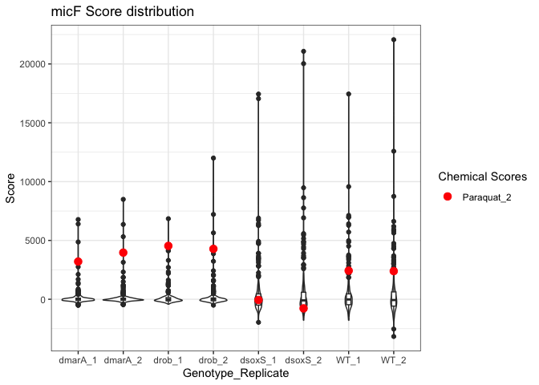<!-- -->

``` r
ggsave(filename = path_target("micf_score_paraquat.png"), plot=g, dpi=300)
```

    ## Saving 7 x 5 in image

``` r
chems_of_interest <- c("Caffeine_1")


chem_location <- complete_scores.long %>% 
  mutate(chem_conc = paste(chem_name, concentration, sep="_"),
         genotype_rep = paste(genotype, replicate, sep="_")) %>% 
  dplyr::filter(chem_conc %in% chems_of_interest & promoter == "pmicF" & genotype == "WT")


g <- complete_scores.long %>% 
  mutate(genotype_rep = paste(genotype, replicate, sep="_")) %>% 
  dplyr::filter(promoter=="pmicF" & genotype == "WT") %>% 
  
  ggplot(aes(y=value, x=genotype_rep)) +
  geom_violin() +
  geom_boxplot(width=0.1, fill="white") +
  
  geom_point(data=chem_location, aes(y=value, x=genotype_rep, color=chem_conc), size=3) +
  #geom_line(data=chem_location, aes(y=value, x=genotype_rep, color=chem_conc, group=chem_conc)) +
  
  scale_color_manual(values = c(Caffeine_1 = "red")) +
  
  theme_bw() +
  labs(y="Expression", x="Genotype", title = "micF Expression", color="Chemical", subtitle = "Response to Caffeine")

g
```

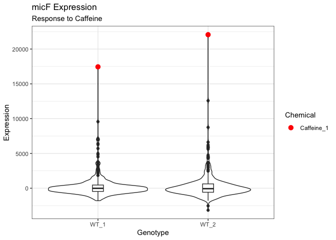<!-- -->

``` r
ggsave(filename = path_target("micf_score_caffeine_wt.png"), plot=g, dpi=300)
```

    ## Saving 7 x 5 in image

Focusing on pacrAB, one can notice that the distribution of scores is
much more compressed when marA is deleted! For all other backgrounds, it
seems like its expression is unaffected

``` r
complete_scores.long %>% 
  mutate(genotype_rep = paste(genotype, replicate, sep="_")) %>% 
  dplyr::filter(promoter=="pacrAB") %>% 
  
  ggplot(aes(x=value, y=genotype_rep, fill=genotype)) +
  geom_violin() +
  geom_boxplot(width=0.1, fill="white") +

  
  theme_bw() +
  theme(legend.position = "none") +
  labs(x="Score", y="Genotype_Replicate", title = "pacrAB Score distribution")
```

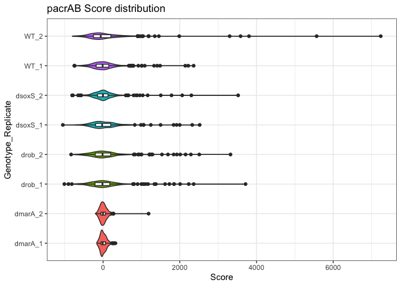

In the case of micF, it seems like its expression is affected by the
deletion of rob or marA.

``` r
complete_scores.long %>% 
  mutate(genotype_rep = paste(genotype, replicate, sep="_")) %>% 
  dplyr::filter(promoter=="pmicF") %>% 
  
  ggplot(aes(x=value, y=genotype_rep, fill=genotype)) +
  geom_violin() +
  geom_boxplot(width=0.1, fill="white") +

  
  theme_bw() +
  theme(legend.position = "none") +
  labs(x="Score", y="Genotype_Replicate", title = "pmicF Score distribution")
```

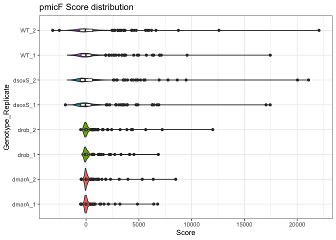<!-- -->

``` r
complete_scores.long %>% 
  mutate(genotype_rep = paste(genotype, replicate, sep="_")) %>% 
  dplyr::filter(promoter=="pompF") %>% 
  
  ggplot(aes(x=value, y=genotype_rep, fill=genotype)) +
  geom_violin() +
  geom_boxplot(width=0.1, fill="white") +

  
  theme_bw() +
  theme(legend.position = "none") +
  labs(x="Score", y="Genotype_Replicate", title = "pompF Score distribution")
```

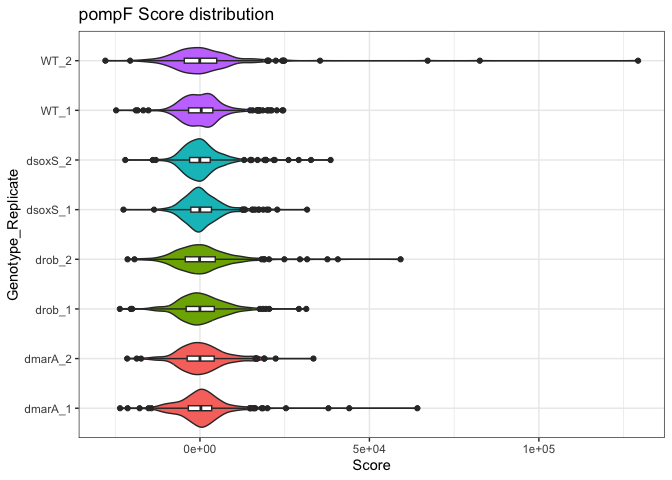

``` r
complete_scores.long %>% 
  mutate(genotype_rep = paste(genotype, replicate, sep="_")) %>% 
  dplyr::filter(promoter=="ptolC") %>% 
  
  ggplot(aes(x=value, y=genotype_rep, fill=genotype)) +
  geom_violin() +
  geom_boxplot(width=0.1, fill="white") +

  
  theme_bw() +
  theme(legend.position = "none") +
  labs(x="Score", y="Genotype_Replicate", title = "ptolC Score distribution")
```

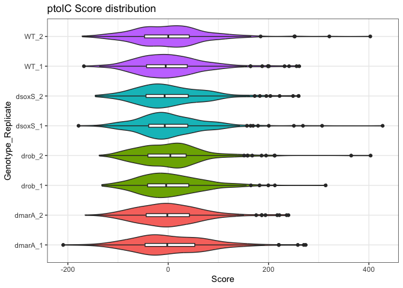

``` r
complete_scores.long %>% 
  mutate(genotype_rep = paste(genotype, replicate, sep="_")) %>% 
  dplyr::filter(promoter=="psoxS") %>% 
  
  ggplot(aes(x=value, y=genotype_rep, fill=genotype)) +
  geom_violin() +
  geom_boxplot(width=0.1, fill="white") +

  
  theme_bw() +
  theme(legend.position = "none") +
  labs(x="Score", y="Genotype_Replicate", title = "psoxS Score distribution")
```

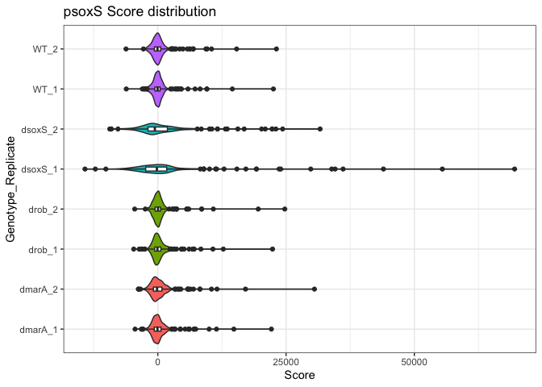

``` r
complete_scores.long %>% 
  mutate(genotype_rep = paste(genotype, replicate, sep="_")) %>% 
  dplyr::filter(promoter=="prob") %>% 
  
  ggplot(aes(x=value, y=genotype_rep, fill=genotype)) +
  geom_violin() +
  geom_boxplot(width=0.1, fill="white") +

  
  theme_bw() +
  theme(legend.position = "none") +
  labs(x="Score", y="Genotype_Replicate", title = "prob Score distribution")
```

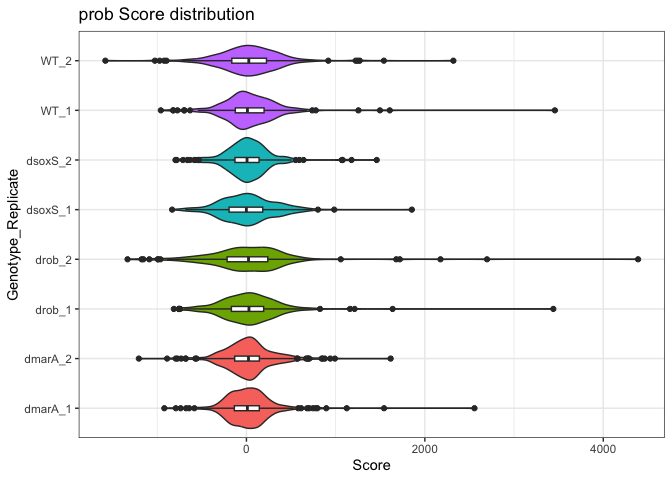

``` r
complete_scores.long %>% 
  mutate(genotype_rep = paste(genotype, replicate, sep="_")) %>% 
  dplyr::filter(promoter=="pmarRAB") %>% 
  
  ggplot(aes(x=value, y=genotype_rep, fill=genotype)) +
  geom_violin() +
  geom_boxplot(width=0.1, fill="white") +

  
  theme_bw() +
  theme(legend.position = "none") +
  labs(x="Score", y="Genotype_Replicate", title = "pmarRAB Score distribution")
```

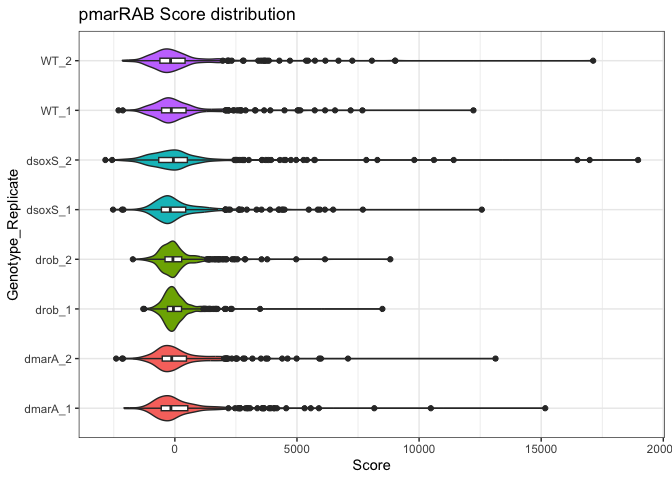

## Joint Distribution

``` r
complete_scores.long %>% 
  mutate(replicate = paste("rep", replicate, sep="_")) %>% 
  dplyr::filter(promoter=="prob") %>% 
  
  ggplot(aes(x=value, y=replicate)) + 
  
  ggdist::stat_halfeye(
    adjust = .5, 
    width = .6, 
    .width = 0, 
    point_colour = NA,
    fill=alpha("#C5C5C5", 0.5)) +
   geom_boxplot(
    width = .25,
    outlier.colour = alpha("black", 0.5),
    outlier.size = 0.1
    
  )  +
  
  theme_classic() +
  labs(x="Score", y="Density", title = "prob joint score distribution")
```

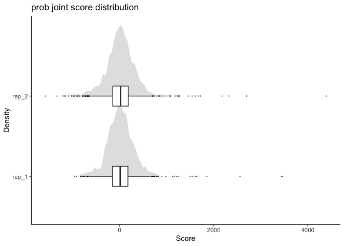<!-- -->

Now soxS

``` r
complete_scores.long %>% 
  mutate(replicate = paste("rep", replicate, sep="_")) %>% 
  dplyr::filter(promoter=="psoxS") %>% 
  
  ggplot(aes(x=value, y=replicate)) + 
  
  ggdist::stat_halfeye(
    adjust = .5, 
    width = .6, 
    .width = 0, 
    point_colour = NA,
    fill=alpha("#C5C5C5", 0.5)) +
   geom_boxplot(
    width = .25,
    outlier.colour = alpha("black", 0.5),
    outlier.size = 0.1
    
  )  +
  
  theme_classic() +
  labs(x="Score", y="Density", title = "psoxS joint score distribution")
```

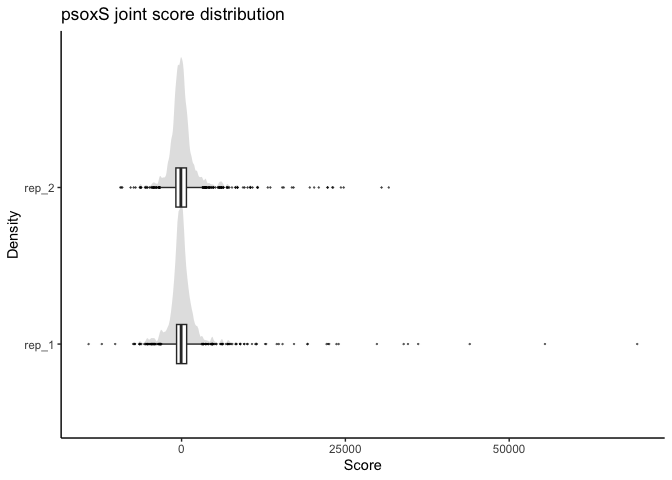<!-- -->

Now marA

``` r
complete_scores.long %>% 
  mutate(replicate = paste("rep", replicate, sep="_")) %>% 
  dplyr::filter(promoter=="pmarRAB") %>% 
  
  ggplot(aes(x=value, y=replicate)) + 
  
  ggdist::stat_halfeye(
    adjust = .5, 
    width = .6, 
    .width = 0, 
    point_colour = NA,
    fill=alpha("#C5C5C5", 0.5)) +
   geom_boxplot(
    width = .25,
    outlier.colour = alpha("black", 0.5),
    outlier.size = 0.1
    
  )  +
  
  theme_classic() +
  labs(x="Score", y="Density", title = "pmarRAB joint score distribution")
```

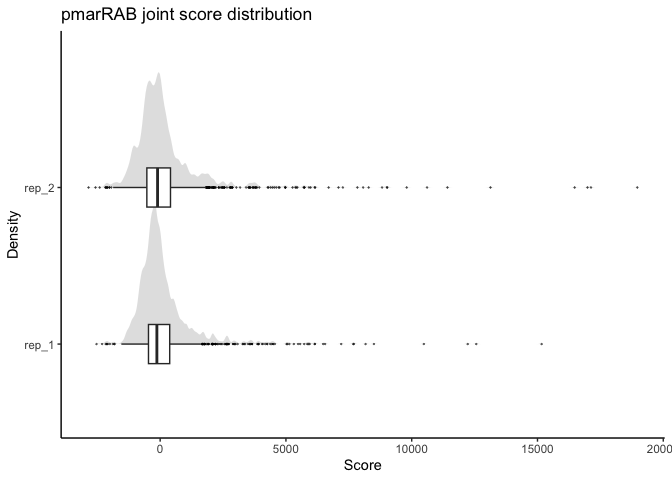<!-- -->

Now micF

``` r
complete_scores.long %>% 
  mutate(replicate = paste("rep", replicate, sep="_")) %>% 
  dplyr::filter(promoter=="pmicF") %>% 
  
  ggplot(aes(x=value, y=replicate)) + 
  
  ggdist::stat_halfeye(
    adjust = .5, 
    width = .6, 
    .width = 0, 
    point_colour = NA,
    fill=alpha("#C5C5C5", 0.5)) +
   geom_boxplot(
    width = .25,
    outlier.colour = alpha("black", 0.5),
    outlier.size = 0.1
    
  )  +
  
  theme_classic() +
  labs(x="Score", y="Density", title = "pmicF joint score distribution")
```

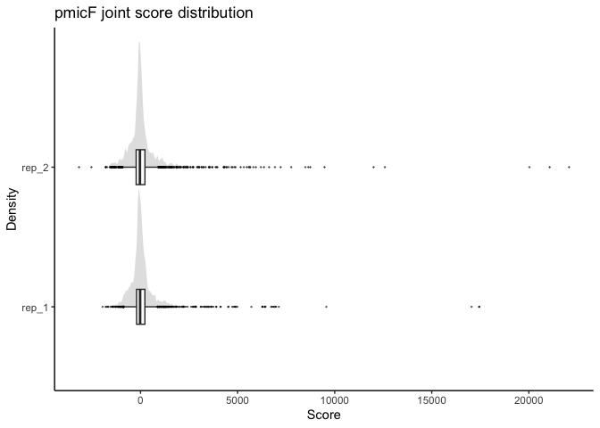<!-- -->

Now ompF

``` r
complete_scores.long %>% 
  mutate(replicate = paste("rep", replicate, sep="_")) %>% 
  dplyr::filter(promoter=="pompF") %>% 
  
  ggplot(aes(x=value, y=replicate)) + 
  
  ggdist::stat_halfeye(
    adjust = .5, 
    width = .6, 
    .width = 0, 
    point_colour = NA,
    fill=alpha("#C5C5C5", 0.5)) +
   geom_boxplot(
    width = .25,
    outlier.colour = alpha("black", 0.5),
    outlier.size = 0.1
    
  )  +
  
  theme_classic() +
  labs(x="Score", y="Density", title = "pompF joint score distribution")
```

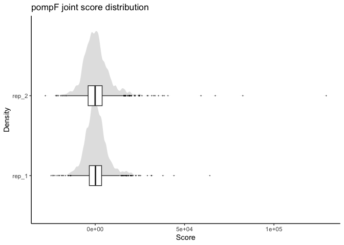<!-- -->

Now tolC

``` r
complete_scores.long %>% 
  mutate(replicate = paste("rep", replicate, sep="_")) %>% 
  dplyr::filter(promoter=="ptolC") %>% 
  
  ggplot(aes(x=value, y=replicate)) + 
  
  ggdist::stat_halfeye(
    adjust = .5, 
    width = .6, 
    .width = 0, 
    point_colour = NA,
    fill=alpha("#C5C5C5", 0.5)) +
   geom_boxplot(
    width = .25,
    outlier.colour = alpha("black", 0.5),
    outlier.size = 0.1
    
  )  +
  
  theme_classic() +
  labs(x="Score", y="Density", title = "ptolC joint score distribution")
```

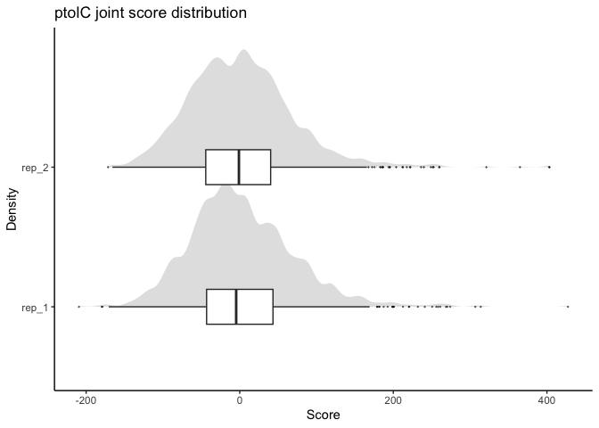<!-- -->

Now acrAB

``` r
complete_scores.long %>% 
  mutate(replicate = paste("rep", replicate, sep="_")) %>% 
  dplyr::filter(promoter=="pacrAB") %>% 
  
  ggplot(aes(x=value, y=replicate)) + 
  
  ggdist::stat_halfeye(
    adjust = .5, 
    width = .6, 
    .width = 0, 
    point_colour = NA,
    fill=alpha("#C5C5C5", 0.5)) +
   geom_boxplot(
    width = .25,
    outlier.colour = alpha("black", 0.5),
    outlier.size = 0.1
    
  )  +
  
  theme_classic() +
  labs(x="Score", y="Density", title = "pacrAB joint score distribution")
```

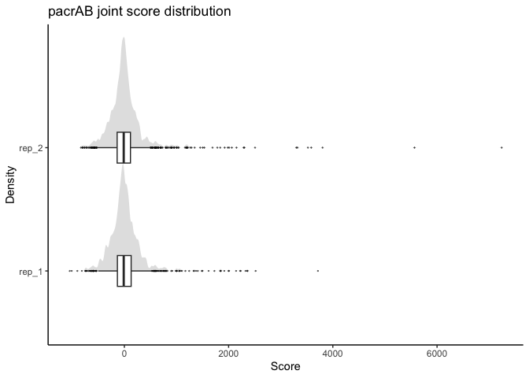<!-- -->

Finally EVC

``` r
complete_scores.long %>% 
  mutate(replicate = paste("rep", replicate, sep="_")) %>% 
  dplyr::filter(promoter=="EVC") %>% 
  
  ggplot(aes(x=value, y=replicate)) + 
  
  ggdist::stat_halfeye(
    adjust = .5, 
    width = .6, 
    .width = 0, 
    point_colour = NA,
    fill=alpha("#C5C5C5", 0.5)) +
   geom_boxplot(
    width = .25,
    outlier.colour = alpha("black", 0.5),
    outlier.size = 0.1
    
  )  +
  
  theme_classic() +
  labs(x="Score", y="Density", title = "EVC joint score distribution")
```

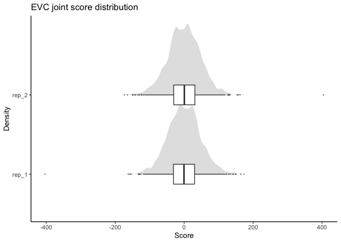<!-- -->

I would summarise that the distribution of each gene is quite distinct
from each other. However, replicates of the same gene seem to be pretty
similar. No clear bimodal distributions.

## Quantile normalization

Quantile normalization to account for baseline changes in expression due
to removal of a gene.

``` r
gene_expression <- complete_scores.long %>% 
  # Get the genotype_replicate
  mutate(genotype_rep = paste(genotype, replicate, sep="_"),
         chem_conc = paste(chem_name, concentration, sep = ":")) %>% 
  
  # filter for gene of interest
  dplyr::filter(promoter=="pmicF") %>% 
  
  # Pivot to matrix
  pivot_wider(id_cols = chem_conc, names_from = genotype_rep, values_from = value) %>% 
  column_to_rownames("chem_conc")

qnormed_scores <- as.data.frame(preprocessCore::normalize.quantiles(as.matrix(gene_expression)))

row.names(qnormed_scores) <- row.names(gene_expression)
colnames(qnormed_scores) <- colnames(gene_expression)

qnormed_scores.long <- qnormed_scores %>% 
  # Long form
  rownames_to_column("chem_conc") %>% 
  pivot_longer(cols = -c(chem_conc), names_to = "genotype_rep") %>% 
  
  # Get all original data back
  separate(chem_conc, into = c("chem_name", "concentration"), sep=":", remove=FALSE) %>% 
  separate(genotype_rep, into = c("genotype", "replicate"), sep="_", remove = FALSE)


qnormed_scores.long %>% 
  
  ggplot(aes(y=value, x=genotype_rep, fill=genotype)) +
  geom_violin() +
  geom_boxplot(width=0.1, fill="white") +
  
  theme_bw() +
  theme(legend.position = "none") +
  labs(x="Score", y="Genotype_Replicate", title = "QNORM-Score distribution by promoter")
```

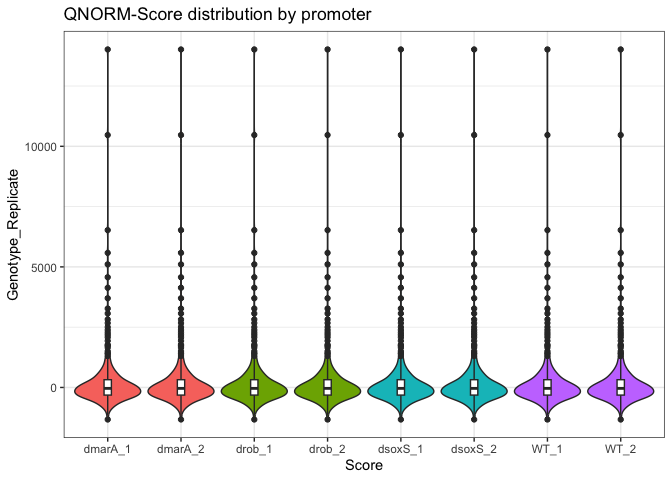<!-- -->

``` r
chems_of_interest <- c("Caffeine:1")


chem_location <- qnormed_scores.long %>% 
  dplyr::filter(chem_conc %in% chems_of_interest)

g <- qnormed_scores.long %>% 
  ggplot(aes(y=value, x=genotype_rep)) +
  geom_violin() +
  geom_boxplot(width=0.1, fill="white") +
  
  geom_point(data=chem_location, aes(y=value, x=genotype_rep, color=chem_conc), size=3) +
  
  scale_color_manual(values=c(`Caffeine:1` = "red")) +
  
  theme_bw() +
  labs(y="Score", x="Genotype_Replicate", title = "micF", subtitle = "Quantile normalised score distribution", color="Chemical Score")


g
```

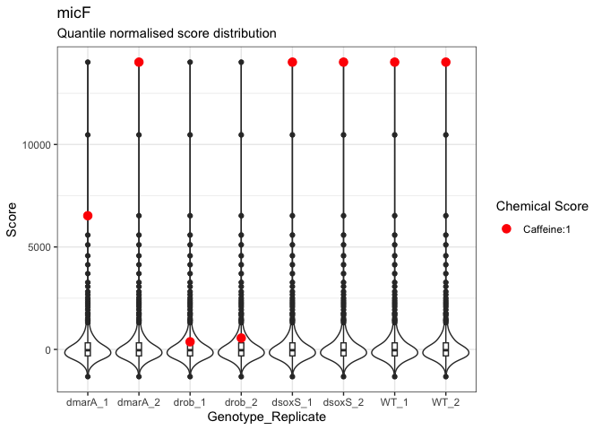<!-- -->

``` r
ggsave(filename = path_target("micf_qnorm_caffeine.png"), plot=g, dpi=300)
```

    ## Saving 7 x 5 in image

``` r
qnorm_by_gene <- function(gene_name, df = complete_scores.long){
  
  gene_expression <- df %>% 
    
    # Get the genotype_replicate
    mutate(genotype_rep = paste(genotype, replicate, sep="_"),
         chem_conc = paste(chem_name, concentration, sep = ":")) %>% 
    
    # filter for gene of interest
    dplyr::filter(promoter==gene_name) %>% 
    
    # Pivot to matrix
    pivot_wider(id_cols = chem_conc, names_from = genotype_rep, values_from = value) %>% 
    column_to_rownames("chem_conc")
  
  # Qnormed scores
  qnormed_scores <- as.data.frame(preprocessCore::normalize.quantiles(as.matrix(gene_expression)))
  
  row.names(qnormed_scores) <- row.names(gene_expression)
  colnames(qnormed_scores) <- colnames(gene_expression)
  
  # Qnorm long format
  qnormed_scores.long <- qnormed_scores %>% 
    # Long form
    rownames_to_column("chem_conc") %>% 
    pivot_longer(cols = -c(chem_conc), names_to = "genotype_rep") %>% 
    
    # Get all original data back
    separate(chem_conc, into = c("chem_name", "concentration"), sep=":", remove=FALSE) %>% 
    separate(genotype_rep, into = c("genotype", "replicate"), sep="_", remove = FALSE) %>% 
    
    mutate(promoter = gene_name)
  
  return(qnormed_scores.long)
  
}

qnorm_all.long <- bind_rows(lapply(unique(complete_scores.long$promoter), qnorm_by_gene))
```

``` r
g <- qnorm_all.long %>% 
  
  ggplot(aes(x=value, y=genotype_rep, fill=genotype)) +
  geom_violin() +
  geom_boxplot(width=0.1, fill="white") +
  
  facet_wrap(~promoter, ncol=4, scales = "free") +
  
  theme_bw() +
  theme(legend.position = "none") +
  labs(x="Score", y="Genotype_Replicate", title = "QNORM-Score distribution by promoter")


g
```

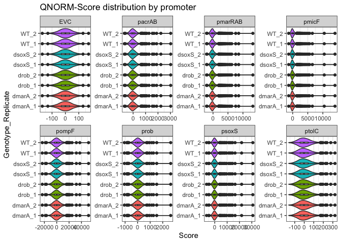<!-- -->

``` r
ggsave(filename=path_target("qnormed_scores.png"), plot=g, dpi=300)
```

    ## Saving 7 x 5 in image

## Clustering

``` r
# Rows: Chems, # Columns: promoter_rep
normalised_scores.pivot <- qnorm_all.long %>% 
  mutate(promoter_rep = paste(promoter, replicate, sep="_"),
         chem_conc_genotype = paste(chem_name, concentration, genotype, sep="_")) %>% 
  pivot_wider(id_cols = chem_conc_genotype, names_from = promoter_rep, values_from = value) %>% 
  column_to_rownames("chem_conc_genotype")
```

``` r
quantile_breaks <- function(xs, n = 10) {
  breaks <- quantile(as.matrix(xs), probs = seq(0, 1, length.out = n))
  breaks[!duplicated(breaks)]
}

mat_breaks <- quantile_breaks(normalised_scores.pivot, n = 10)
mat_breaks
```

    ##           0%    11.11111%    22.22222%    33.33333%    44.44444%    55.55556% 
    ## -23415.15930   -825.01019   -298.91962   -104.32920    -31.80872     12.51796 
    ##    66.66667%    77.77778%    88.88889%         100% 
    ##     73.72462    256.82667   1104.74703  51522.99196

``` r
pheatmap::pheatmap(normalised_scores.pivot, 
                   
                   # Clustering Params
                   clustering_distance_cols = "correlation",
                   clustering_distance_rows = "correlation",
                   clustering_method = "ward.D2",
                  
                   # Presentation Details
                   show_rownames = FALSE,
                   breaks = mat_breaks,
                   color=rev(RColorBrewer::brewer.pal(length(mat_breaks)-1, "RdBu")))
```

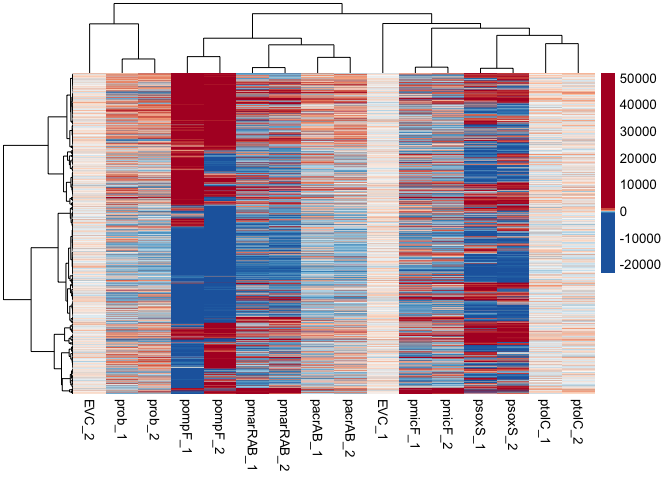<!-- -->

Well, I think the most obvious conclusion from this is that replicates
cluster together. That’s good!!

### Specific Compounds

I’m just generally curious to see how some compounds behave across
genotypes

``` r
chems_of_interest <- c("Caffeine_1", "Salicylate_1")


chem_location <- qnorm_all.long %>% 
  mutate(chem_conc = paste(chem_name, concentration, sep="_"),
         genotype_rep = paste(genotype, replicate, sep="_")) %>% 
  dplyr::filter(chem_conc %in% chems_of_interest & promoter == "pmicF")

qnorm_all.long %>% 
  mutate(genotype_rep = paste(genotype, replicate, sep="_")) %>% 
  dplyr::filter(promoter=="pmicF") %>% 
  
  ggplot(aes(y=value, x=genotype_rep)) +
  geom_violin() +
  geom_boxplot(width=0.1, fill="white") +
  
  geom_point(data=chem_location, aes(y=value, x=genotype_rep, color=chem_conc)) +

  
  theme_bw() +
  labs(y="Score", x="Genotype_Replicate", title = "pmicF Score distribution", color="Chemical")
```

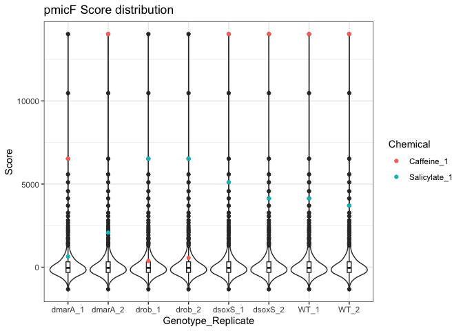

Now this is a super cool phenomenon! When rob is present then caffeine
is always among the top hits. Once rob is deleted, Caffeine is longer
among the top!!! Sort of the inverse is happening with Salicylate!
Amazing honestly.

What happens to these compounds in the promoters?

``` r
chems_of_interest <- c("Caffeine_1", "Salicylate_1")


chem_location <- qnorm_all.long %>% 
  mutate(chem_conc = paste(chem_name, concentration, sep="_"),
         genotype_rep = paste(genotype, replicate, sep="_")) %>% 
  dplyr::filter(chem_conc %in% chems_of_interest & promoter == "pmarRAB")

qnorm_all.long %>% 
  mutate(genotype_rep = paste(genotype, replicate, sep="_")) %>% 
  dplyr::filter(promoter=="pmarRAB") %>% 
  
  ggplot(aes(y=value, x=genotype_rep)) +
  geom_violin() +
  geom_boxplot(width=0.1, fill="white") +
  
  geom_point(data=chem_location, aes(y=value, x=genotype_rep, color=chem_conc)) +

  
  theme_bw() +
  labs(y="Score", x="Genotype_Replicate", title = "pmarRAB Score distribution", color="Chemical")
```

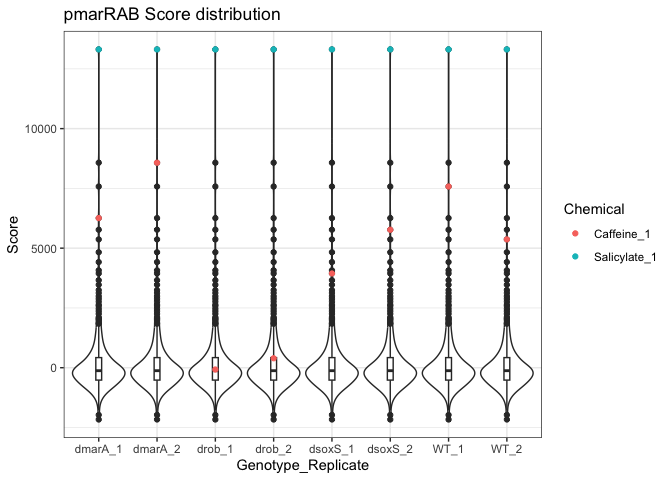

``` r
chems_of_interest <- c("Caffeine_1", "Salicylate_1")


chem_location <- qnorm_all.long %>% 
  mutate(chem_conc = paste(chem_name, concentration, sep="_"),
         genotype_rep = paste(genotype, replicate, sep="_")) %>% 
  dplyr::filter(chem_conc %in% chems_of_interest & promoter == "prob")

qnorm_all.long %>% 
  mutate(genotype_rep = paste(genotype, replicate, sep="_")) %>% 
  dplyr::filter(promoter=="prob") %>% 
  
  ggplot(aes(y=value, x=genotype_rep)) +
  geom_violin() +
  geom_boxplot(width=0.1, fill="white") +
  
  geom_point(data=chem_location, aes(y=value, x=genotype_rep, color=chem_conc)) +

  
  theme_bw() +
  labs(y="Score", x="Genotype_Replicate", title = "prob Score distribution", color="Chemical")
```

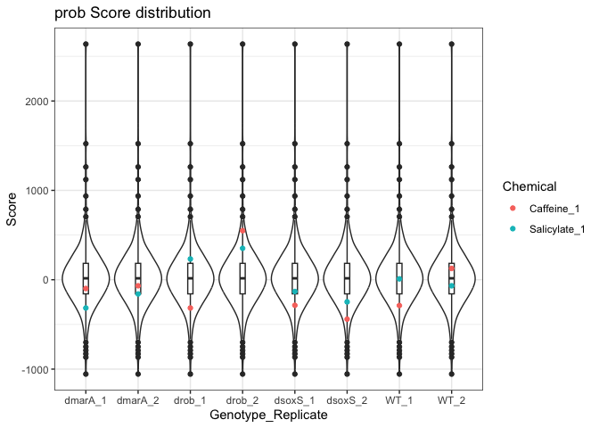

## Write Files

``` r
write_tsv(complete_scores.long,path_target("raw_scores_complete.tsv.gz"))
write_tsv(qnorm_all.long, path_target("qnormed_scores_complete.tsv.gz"))
```

## Files written

These files have been written to the target directory,
`data/01-data_exploration`:

``` r
projthis::proj_dir_info(path_target())
```

    ## # A tibble: 8 × 4
    ##   path                           type         size modification_time  
    ##   <fs::path>                     <fct> <fs::bytes> <dttm>             
    ## 1 micf_qnorm_caffeine.png        file         155K 2025-05-29 17:20:44
    ## 2 micf_score_caffeine_wt.png     file        94.2K 2025-05-29 17:20:39
    ## 3 micf_score_paraquat.png        file         118K 2025-05-29 17:20:38
    ## 4 qnormed_scores.png             file       459.9K 2025-05-29 17:20:49
    ## 5 qnormed_scores_complete.tsv.gz file       207.2K 2025-05-29 17:20:51
    ## 6 raw_scores_complete.tsv.gz     file       320.3K 2025-05-29 17:20:51
    ## 7 score_distribution.pdf         file       289.8K 2025-05-29 17:20:37
    ## 8 score_distribution.png         file       251.8K 2025-05-29 17:20:35

## Session Info.

``` r
sessionInfo()
```

    ## R version 4.3.1 (2023-06-16)
    ## Platform: x86_64-apple-darwin20 (64-bit)
    ## Running under: macOS 15.4.1
    ## 
    ## Matrix products: default
    ## BLAS:   /Library/Frameworks/R.framework/Versions/4.3-x86_64/Resources/lib/libRblas.0.dylib 
    ## LAPACK: /Library/Frameworks/R.framework/Versions/4.3-x86_64/Resources/lib/libRlapack.dylib;  LAPACK version 3.11.0
    ## 
    ## locale:
    ## [1] en_US.UTF-8/en_US.UTF-8/en_US.UTF-8/C/en_US.UTF-8/en_US.UTF-8
    ## 
    ## time zone: Europe/Berlin
    ## tzcode source: internal
    ## 
    ## attached base packages:
    ## [1] stats     graphics  grDevices utils     datasets  methods   base     
    ## 
    ## other attached packages:
    ##  [1] lubridate_1.9.2 forcats_1.0.0   stringr_1.5.0   dplyr_1.1.2    
    ##  [5] purrr_1.0.2     readr_2.1.4     tidyr_1.3.0     tibble_3.2.1   
    ##  [9] ggplot2_3.5.1   tidyverse_2.0.0
    ## 
    ## loaded via a namespace (and not attached):
    ##  [1] ggdist_3.3.0          utf8_1.2.4            generics_0.1.3       
    ##  [4] stringi_1.7.12        hms_1.1.3             digest_0.6.33        
    ##  [7] magrittr_2.0.3        RColorBrewer_1.1-3    evaluate_0.21        
    ## [10] grid_4.3.1            timechange_0.2.0      fastmap_1.1.1        
    ## [13] rprojroot_2.0.3       plyr_1.8.9            gridExtra_2.3        
    ## [16] fansi_1.0.6           preprocessCore_1.62.1 scales_1.3.0         
    ## [19] UpSetR_1.4.0          textshaping_0.3.6     cli_3.6.3            
    ## [22] crayon_1.5.2          projthis_0.0.0.9025   rlang_1.1.4          
    ## [25] bit64_4.0.5           munsell_0.5.0         withr_2.5.2          
    ## [28] yaml_2.3.7            parallel_4.3.1        tools_4.3.1          
    ## [31] tzdb_0.4.0            colorspace_2.1-0      here_1.0.1           
    ## [34] vctrs_0.6.5           R6_2.5.1              lifecycle_1.0.4      
    ## [37] bit_4.0.5             fs_1.6.3              vroom_1.6.3          
    ## [40] ragg_1.2.5            pkgconfig_2.0.3       pillar_1.9.0         
    ## [43] gtable_0.3.4          glue_1.7.0            Rcpp_1.0.13          
    ## [46] systemfonts_1.1.0     xfun_0.40             tidyselect_1.2.0     
    ## [49] highr_0.10            rstudioapi_0.15.0     knitr_1.43           
    ## [52] farver_2.1.1          htmltools_0.5.6       rmarkdown_2.24       
    ## [55] labeling_0.4.3        pheatmap_1.0.12       compiler_4.3.1       
    ## [58] distributional_0.3.2
