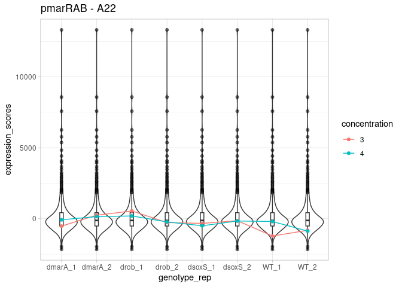
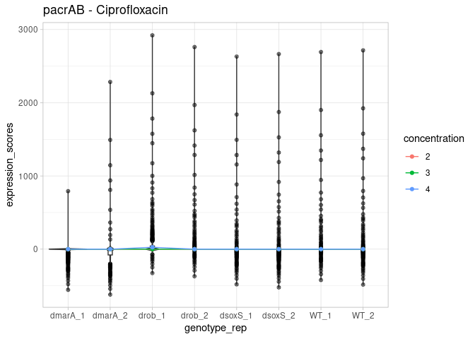
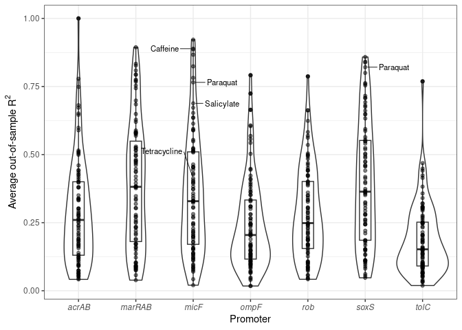
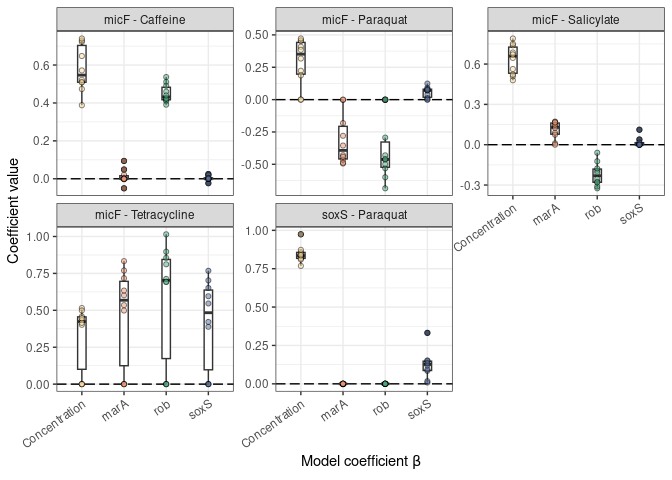
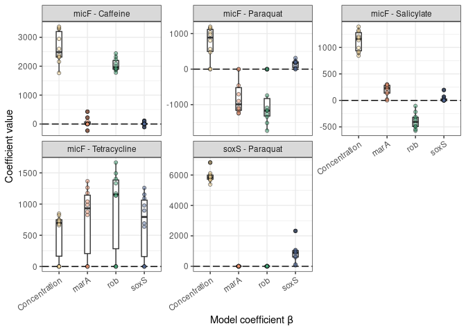

03-cross_validation
================
Compiled at 2025-05-29 19:48:15 UTC

``` r
here::i_am(paste0(params$name, ".Rmd"), uuid = "6ee83696-c9b5-4212-8ecb-395987467d72")
```

The purpose of this document is …

``` r
library(tidyverse)
```

    ## ── Attaching core tidyverse packages ──────────────────────── tidyverse 2.0.0 ──
    ## ✔ dplyr     1.1.4     ✔ readr     2.1.5
    ## ✔ forcats   1.0.0     ✔ stringr   1.5.1
    ## ✔ ggplot2   3.5.1     ✔ tibble    3.2.1
    ## ✔ lubridate 1.9.3     ✔ tidyr     1.3.1
    ## ✔ purrr     1.0.2     
    ## ── Conflicts ────────────────────────────────────────── tidyverse_conflicts() ──
    ## ✖ dplyr::filter() masks stats::filter()
    ## ✖ dplyr::lag()    masks stats::lag()
    ## ℹ Use the conflicted package (<http://conflicted.r-lib.org/>) to force all conflicts to become errors

``` r
library(hierNet)
```

``` r
# create or *empty* the target directory, used to write this file's data: 
projthis::proj_create_dir_target(params$name, clean = TRUE)

# function to get path to target directory: path_target("sample.csv")
path_target <- projthis::proj_path_target(params$name)

# function to get path to previous data: path_source("00-import", "sample.csv")
path_source <- projthis::proj_path_source(params$name)
```

## Read Data

First we read in the scores that we normalised in the previous step. We
can also get more information about the drugs by reading the Map.txt
file.

``` r
normed_scores <- read_tsv(path_source("01-data_exploration", "qnormed_scores_complete.tsv.gz"), show_col_types = FALSE) %>%
  mutate(promoter_rep = paste(promoter, replicate, sep="_"))


map_file <- read_tsv(path_source("00-import", "Map.txt"), show_col_types = FALSE)
```

We can combine with the information we have in normed_scores

``` r
concentration_info <- map_file %>% 
  mutate(chem_conc = paste(Drug, ConcMock, sep=":")) %>% 
  select(chem_conc, Conc)
```

``` r
normed_scores %>% 
  head() %>% 
  knitr::kable()
```

| chem_conc           | chem_name         | concentration | genotype_rep | genotype | replicate |      value | promoter | promoter_rep |
|:--------------------|:------------------|--------------:|:-------------|:---------|----------:|-----------:|:---------|:-------------|
| 1-Methyluric acid:1 | 1-Methyluric acid |             1 | WT_1         | WT       |         1 |   1.526437 | EVC      | EVC_1        |
| 1-Methyluric acid:1 | 1-Methyluric acid |             1 | WT_2         | WT       |         2 |  -1.526437 | EVC      | EVC_2        |
| 1-Methyluric acid:1 | 1-Methyluric acid |             1 | dmarA_1      | dmarA    |         1 | -17.609143 | EVC      | EVC_1        |
| 1-Methyluric acid:1 | 1-Methyluric acid |             1 | dmarA_2      | dmarA    |         2 |  17.609143 | EVC      | EVC_2        |
| 1-Methyluric acid:1 | 1-Methyluric acid |             1 | drob_1       | drob     |         1 |  17.609143 | EVC      | EVC_1        |
| 1-Methyluric acid:1 | 1-Methyluric acid |             1 | drob_2       | drob     |         2 | -17.609143 | EVC      | EVC_2        |

``` r
map_file %>% 
  head() %>% 
  knitr::kable()
```

|  Nr | Well | Drug              |  Conc | ConcMock | Category             | Class                | Target               | Action |
|----:|:-----|:------------------|------:|---------:|:---------------------|:---------------------|:---------------------|:-------|
|   1 | A1   | Water_1           |   0.0 |        1 | Water                | Water                | Water                | NA     |
|   2 | A2   | Water_1           |   0.0 |        2 | Water                | Water                | Water                | NA     |
|   3 | A3   | 1-Methyluric acid |  91.1 |        1 | Human metabolite     | Human metabolite     | Human metabolite     | NA     |
|   4 | A4   | 1-Methyluric acid |  45.5 |        2 | Human metabolite     | Human metabolite     | Human metabolite     | NA     |
|   5 | A5   | 2,3-DHBA          | 154.1 |        1 | Bacterial metabolite | Bacterial metabolite | Bacterial metabolite | NA     |
|   6 | A6   | 2,3-DHBA          |  77.1 |        2 | Bacterial metabolite | Bacterial metabolite | Bacterial metabolite | NA     |

## Score exploration.

Now it becomes important to see how many measurements we have for a
given prediction task. Say we want to evaluate the effect that caffeine
has on micF. How many measurements do we have? At most, we have 32
examples given that for each promoter-compound pair we have 4
concentrations x 4 genotypes x 2 replicates

Now, we know that some pairs, such as pmicF-Caffeine have large changes
in gene expression due to different genetic backgrounds. In comparison,
something like pmicF-Adrenalin almost does not change.

``` r
explore_qnormed <- function(promoter_name, chemical_name, scores_df = normed_scores, score_column="value"){
  
  # Gather the correct scores
  scores_df <- scores_df %>% 
    rename("expression_scores" = all_of(score_column))
  
  
  # Gather the data for the promoter compound
  pchem.df <- scores_df %>% 
  
  filter(promoter == promoter_name,
         chem_name == chemical_name) %>% 
  
  mutate(concentration = factor(concentration, levels=sort(unique(concentration))))
  
  
  # Gather the data for the promoter
  prom.df <- scores_df %>% 
    filter(promoter == promoter_name)
  
  # Create plot
  p <- ggplot(prom.df, aes(x=genotype_rep, y=expression_scores)) + 
    geom_violin() +
    geom_boxplot(width=0.1, fill="white", outlier.colour = alpha("black", 0.5)) +
    
    geom_line(data=pchem.df, aes(x=genotype_rep, y=expression_scores, color=concentration, group=chem_conc)) +
    geom_point(data=pchem.df, aes(x=genotype_rep, y=expression_scores, color=concentration, group=chem_conc)) +
    
    theme_light() +
    ggtitle(paste0(promoter_name, " - ", chemical_name))
  
  
  return(p)
  
  
  
  
}
```

``` r
explore_qnormed("pmarRAB", "A22")
```

<!-- -->

To account for these expected baseline changes I had proposed a
soft-thresholding approach which I colloquially call
water-normalisation. I explain that more in *r-02-expression_modelling*.
Here I will just do it.

## Water signal soft-thresholding.

``` r
complete.wranges <- normed_scores %>% 
  dplyr::filter(chem_name %in% c("Water_1", "Water_2")) %>% 
  
  group_by(promoter, genotype_rep) %>% 
  
  summarise(water_max = max(value),
            water_min = min(value)) %>% 
  
  ungroup() %>% 
  
  unite(promoter, genotype_rep, col = "promoter_genotype_rep")
```

    ## `summarise()` has grouped output by 'promoter'. You can override using the
    ## `.groups` argument.

Normalise scores

``` r
wthresh.scores <- normed_scores %>% 
  unite(promoter, genotype_rep, col = "promoter_genotype_rep", remove = FALSE) %>% 
  
  left_join(complete.wranges, by="promoter_genotype_rep") %>% 
  
  # Normalise score values
  mutate(value_normed = case_when(value <= water_max & value >= water_min ~ 0,
                                  value > water_max ~ value - water_max,
                                  value < water_min ~ value - water_min,
                                  TRUE ~ value))
```

## Design matrix and response

We can start to build $X$.

``` r
scores_with_design <- wthresh.scores %>% 
  
  # Treatment effects
  mutate(t_rob = if_else(genotype == "drob", 0, 1),
         
         t_mara = if_else(genotype == "dmarA", 0, 1),
         
         t_soxs = if_else(genotype == "dsoxS", 0, 1),
         
         # Correct concentration scales
         concentration = (concentration * -1) + 5,
         concentration = 2 ^ (concentration - 1))
```

Build a function that returns the design matrix for a given
promoter-compound pair.

``` r
build_features <- function(promoter_name, chemical_name, score_column = "value_normed", score_df = scores_with_design, scale_value=TRUE){
  
  # Gather the appropiate values
  X.df <- score_df %>% 
    filter(promoter == promoter_name,
           chem_name == chemical_name) %>% 
    
    rename("y" = all_of(score_column)) %>% 
    
    select(y, concentration, t_rob, t_mara, t_soxs)
  
  
  if(scale_value == TRUE){
    X.df <- X.df %>% 
      mutate(y = scale(y),
             y = if_else(is.na(y), 0, y))
    
    X.df$y <- X.df$y[,1]
  }
  
  
  return(X.df)

}
```

## Cross validation.

Create a list of all the CPIs we want to model

``` r
cpi_of_interest <- scores_with_design %>% 
  filter(!chem_name %in% c("Water_1", "Water_2"),
         promoter != "EVC") %>% 
  
  select(chem_name, promoter) %>% 
  distinct() %>% 
  mutate(exp_combo = paste(promoter, chem_name, sep = ":")) %>% 
  select(exp_combo) %>% 
  unlist()
```

function for CPI modelling with CV

``` r
colchecks <- function(X){
  
  # Make sure that there is more than one unique value in the "value" column.
  
  if(X %>% select(y) %>% n_distinct() == 1){
    
    return("no unique values")
    
  }
  
  
  
  # How many concentrations are tested
  nconc <- X %>% 
    select(concentration) %>% 
    n_distinct()
  
  # If only one, then remove concentration column
  if(nconc == 1){
    
    X <- X %>% 
      select(-concentration)
    
  }
  
  return(X)
  
}

r2 <- function(x,y){
  cor(x,y)^2
}

model_evaluation <- function(hnet.obj, train.matrix, testing.matrix){
  
  
  # Training error
  yhat.train <- predict(hnet.obj, as.matrix(train.matrix[ 2:ncol(train.matrix)]))
  r2.train <- r2(train.matrix$y, yhat.train)
  
  # Testing error
  yhat.test <- predict(hnet.obj, as.matrix(testing.matrix[ 2:ncol(testing.matrix)]))
  r2.test <- r2(testing.matrix$y, yhat.test)
  
  
  return(c("train.error"=r2.train, "test.error"=r2.test))
  
}
  
  


gather_model_coefficients <- function(hnet.obj, X){
  
  # Gather interaction matrix
  imat <- hnet.obj$th
  
  # Interaction effects
  colnames(imat) <- row.names(imat) <- colnames(as.matrix(X[, 2:ncol(X)]))
  
  # Main effects
  main_effects <- hnet.obj$bp - hnet.obj$bn
  names(main_effects) <- colnames(as.matrix(X[, 2:ncol(X)]))

  # Replace for viz
  for(v in names(main_effects)){
  imat[v, v] = main_effects[v]
  }
  
  # Set lower triangle to NA
  imat[lower.tri(imat)] <- NA
  
  
  # Format output into dataframe
  estim_coefs <- as.data.frame(imat) %>% 
    rownames_to_column("c1") %>% 
    
    # Pivot to longform
    pivot_longer(cols = colnames(as.matrix(X[, 2:ncol(X)])),
               names_to = "c2",
               values_to = "coef_value") %>% 
    
    # Create meaningful coefficient names
    mutate(coef_name = if_else(c1 == c2, c1, paste(c1, c2, sep=":"))) %>% 
    
    # Filter repeated interactions
    dplyr::filter(!is.na(coef_value))
  
  return(estim_coefs)
}


final_fit <- function(X, cvobj, zz_mat){
  
  # Perform the final fit
  final.fit.strong <- hierNet(y=X$y, 
                              x=as.matrix(X[, 2:ncol(X)]),
                              lam = cvobj$lamhat.1se, 
                              strong = TRUE,
                              diagonal = FALSE)
                              #zz=zz_mat)
  
  
  # Return the output
  return(final.fit.strong)
}


fit.cv <- function(dmat, tmat, zz_mat, counter=0, maximum_lambda=NULL){
  
  # Perform HierNet
  ## Fit path
  set.seed(42)
  path_fits <- hierNet.path(y=dmat$y, x=as.matrix(dmat[, 2:ncol(dmat)]), 
                            maxlam = maximum_lambda, diagonal = FALSE)
                            #zz=zz_mat)
  
  print("Problem at path fits")
  
  ## Cross-validation for lambda selection
  hiernetcv <- hierNet.cv(fit = path_fits,
           y=dmat$y, 
           x=as.matrix(dmat[, 2:ncol(dmat)]),
           nfolds = 4)
  
  # Check if the minimum lambda is simply the smallest lambda tested (usually is the case)
  min_tested_is_lambdahat = min(hiernetcv$lamlist) == hiernetcv$lamhat
  
  # Re-do fit with adjusted lambda range
  if(min_tested_is_lambdahat & counter < 5){
    
    fit.cv(dmat, tmat, zz_mat, counter = counter + 1, maximum_lambda=hiernetcv$lamhat.1se)
    
  }
  
  # Gather the final fit with the optimal lambda
  hnet.final.fit <- final_fit(dmat, hiernetcv, zz_mat)
  
  # Evaluate on test set
  hnet.performance <- model_evaluation(hnet.final.fit, dmat, tmat)
  
  # Gather model coeficients
  estimated_coefficients <- gather_model_coefficients(hnet.final.fit, dmat) %>% 
     mutate("lambda.min_is_smallest.lambda" = min_tested_is_lambdahat,
           "lambda.value" = hiernetcv$lamhat.1se,
           "train.rsq" = hnet.performance[["train.error"]],
           "test.rsq" = hnet.performance[["test.error"]])
  
  return(estimated_coefficients)

  
}


cpi.cv <- function(split_number, cpi_df, test_set_size=0.25){
  
  # Determine the number of samples in the test_set
  nsamples_test <- round(nrow(cpi_df) * test_set_size)
  
  # Sample indices for the rows to be used for testing
  set.seed(split_number)
  test_indices <- sample(nrow(cpi_df), size = nsamples_test, replace = FALSE)
  
  # Training and testing CPI dataframes
  cpi.testing <- cpi_df[test_indices,]
  cpi.train <- cpi_df[-test_indices,]
  
  ## with passing zz we avoid that zz gets computed based on the scaled X which is not wanted for binary features
  zz_binary <- compute.interactions.c(as.matrix(cpi_df[2:ncol(cpi_df)]), diagonal = FALSE)
  zz_train <- zz_binary[-test_indices,]
  
  # Do the hierNet
  tryCatch({
    
  hnet.results <- fit.cv(cpi.train, cpi.testing, zz_train)
  # Add experiment information
  hnet.results <- hnet.results %>% 
    mutate(cvfold = split_number,
           test_size=nsamples_test) %>% 
    
    select(-c("c1", "c2")) %>% 
    pivot_wider(id_cols = c(cvfold, lambda.min_is_smallest.lambda, lambda.value, train.rsq, test.rsq, test_size), values_from = coef_value, names_from = coef_name)


   return(hnet.results)
    
  },
  error=function(e) {
            message(paste("Error"))
            print(e)
        })
  
  
}


cpi.performance.cv <- function(cpi_string, n_splits=10, complete_design_matrix = scores_with_design, scale_response=TRUE, test_size=0.25){
  
  # Gather the promoter and the compound to be modelled
  sep_list <- str_split(cpi_string, ":")[[1]]
  gene <- sep_list[1]
  compound <- sep_list[2]
  
  # Gather the design matrix
  design_df <- build_features(promoter_name = gene, 
                               chemical_name = compound, 
                               score_column = "value_normed", 
                               score_df = complete_design_matrix, 
                               scale_value = scale_response)
  
  
  # Check for concentration
  # Some experiments only have one concentration, HierNet breaks in these cases so we need to remove it.
  check.status <- colchecks(design_df)
  
  # Return empty dataframe if there are no unique values in the response columns
  if(is.character(check.status)){
    
    if(check.status == "no unique values"){
      
      # Standard Output
      hnet.results <- data.frame("cvfold" = NA,
                                 "lambda.min_is_smallest.lambda" = NA,
                                 "lambda.value" = NA,
                                 "train.rsq" = NA,
                                 "test.rsq" = NA,
                                 "test_size" = NA,
                                 "concentration" = NA,
                                 "concentration:t_rob" = NA,
                                 "concentration:t_mara" = NA,          
                                 "concentration:t_soxs" = NA,
                                 "t_rob" = NA,
                                 "t_rob:t_mara" = NA,
                                 "t_rob:t_soxs" = NA,
                                 "t_mara" = NA,
                                 "t_mara:t_soxs" = NA,
                                 "t_soxs" = NA,
                                 "promoter" = gene,
                                 "chem_name" = compound,
                                 "n_obs" = nrow(design_df)) 
      

    
      return(hnet.results)
      
    }
  }
  
  # Once the design matrix is ready, perform CV
  #print(design_df)
  
  tryCatch({
    #browser()
    cv.results <- lapply(1:n_splits, cpi.cv, cpi_df = design_df, test_set_size=test_size)
    cv.results <- cv.results[map_lgl(cv.results, is.data.frame)]
    cv.results <- bind_rows(cv.results)
    
    
    # Add info
    cv.results <- cv.results %>% 
    mutate(promoter=gene,
           chem_name=compound,
           
           n_obs = nrow(design_df))
  
  
  return(cv.results)
    
  },
  error=function(e) {
            message(paste("Error for CPI:", cpi_string))
            print(e)
            
            # Standard Output
            hnet.results <- data.frame("cvfold" = NA,
                                 "lambda.min_is_smallest.lambda" = NA,
                                 "lambda.value" = NA,
                                 "train.rsq" = NA,
                                 "test.rsq" = NA,
                                 "test_size" = NA,
                                 "concentration" = NA,
                                 "concentration:t_rob" = NA,
                                 "concentration:t_mara" = NA,          
                                 "concentration:t_soxs" = NA,
                                 "t_rob" = NA,
                                 "t_rob:t_mara" = NA,
                                 "t_rob:t_soxs" = NA,
                                 "t_mara" = NA,
                                 "t_mara:t_soxs" = NA,
                                 "t_soxs" = NA,
                                 "promoter" = gene,
                                 "chem_name" = compound,
                                 "n_obs" = nrow(design_df)) 
            
            
            return(hnet.results)
  }
  
  )
  
  
  
  
}
```

Perform all CPI cross validations

``` r
library(foreach)
```

    ## 
    ## Attaching package: 'foreach'

    ## The following objects are masked from 'package:purrr':
    ## 
    ##     accumulate, when

``` r
doParallel::registerDoParallel(50)


time_started <- proc.time()[3]


cpi.cv.results <- foreach(i = cpi_of_interest, .combine = "bind_rows") %dopar% {
  return(cpi.performance.cv(i))
}
time_ended <- proc.time()[3]

time_diff <- round(time_ended - time_started, 2)
minutes <- floor(time_diff / 60)
minutes
```

    ## elapsed 
    ##       0

For some CPIs, no valid test-set could be create. This is mainly due to
cases where there is little to no signal in the CPIscores. Therefore,
after water normalisation, these scores become 0. No valid model can be
evaluated on these cases

``` r
cpi.retest <- cpi.cv.results %>% 
  group_by(promoter, chem_name) %>% 
  filter(all(is.na(test.rsq))) %>% 
  ungroup() %>% 
  select(promoter, chem_name) %>% 
  distinct() %>% 
  unite("cpi_retest", c(promoter, chem_name), sep=":") %>% 
  pull(cpi_retest)

cpi.retest
```

    ##  [1] "pacrAB:Ciprofloxacin"  "pmarRAB:Progesterone"  "pmicF:Gentamicin"     
    ##  [4] "pmicF:Penicillin G"    "pompF:Moxifloxacin"    "prob:Lithocholic acid"
    ##  [7] "prob:Metformin"        "prob:Puromycin"        "psoxS:Cefaclor"       
    ## [10] "psoxS:Chlorhexidine"   "psoxS:Cidofovir"       "psoxS:Clindamycin"    
    ## [13] "psoxS:Gentamicin"      "ptolC:Amoxicillin"     "ptolC:Sodium urate"   
    ## [16] "ptolC:Tetracycline"

``` r
explore_qnormed("pacrAB", "Ciprofloxacin", scores_df =wthresh.scores, score_column = "value_normed")
```

<!-- -->

The function introduces placeholder columns. We can ignore those

``` r
cpi.cv.results <- cpi.cv.results %>%
  mutate(promoter = substr(promoter, 2, nchar(promoter))) %>% 
  select(-c(concentration.t_rob, concentration.t_mara, concentration.t_soxs, t_rob.t_mara, t_rob.t_soxs, t_mara.t_soxs))
```

## Average model performance

We consider the average R2 value for each CPI. Only folds where a valid
model could be established, and the test set had a non-zero variance are
considered.

``` r
average.cv.performance <- cpi.cv.results %>% 
  filter(!is.na(cvfold)) %>% 
  group_by(promoter, chem_name) %>% 
  summarise(avg.train.r2 = mean(train.rsq, na.rm=TRUE),
            avg.test.r2 = mean(test.rsq, na.rm=TRUE),
            sd.train.r2 = sd(train.rsq, na.rm=TRUE),
            sd.test.r2 = sd(test.rsq, na.rm=TRUE)) %>% 
  ungroup()
```

    ## `summarise()` has grouped output by 'promoter'. You can override using the
    ## `.groups` argument.

``` r
average.cv.performance %>% 
  filter(is.na(avg.test.r2))
```

    ## # A tibble: 14 × 6
    ##    promoter chem_name        avg.train.r2 avg.test.r2 sd.train.r2 sd.test.r2
    ##    <chr>    <chr>                   <dbl>       <dbl>       <dbl>      <dbl>
    ##  1 acrAB    Ciprofloxacin          0.128          NaN      0.0172         NA
    ##  2 marRAB   Progesterone           0.472          NaN      0.134          NA
    ##  3 micF     Gentamicin             0.247          NaN      0.101          NA
    ##  4 micF     Penicillin G           0.530          NaN      0.192          NA
    ##  5 ompF     Moxifloxacin           0.0866         NaN      0.0106         NA
    ##  6 rob      Lithocholic acid       0.117          NaN      0.0276         NA
    ##  7 rob      Metformin              0.125          NaN      0.0241         NA
    ##  8 rob      Puromycin              0.0410         NaN      0.0263         NA
    ##  9 soxS     Cefaclor               0.0410         NaN      0.0263         NA
    ## 10 soxS     Cidofovir              0.132          NaN      0.0174         NA
    ## 11 soxS     Clindamycin            0.136          NaN      0.0200         NA
    ## 12 soxS     Gentamicin             0.0909         NaN      0              NA
    ## 13 tolC     Sodium urate           0.472          NaN      0.134          NA
    ## 14 tolC     Tetracycline           0.210          NaN      0.0610         NA

``` r
cpi.interest <- average.cv.performance %>% 
  unite("cpi", c(promoter, chem_name), sep = ":", remove = FALSE) %>% 
  
  filter(cpi %in% c("soxS:Paraquat", "micF:Caffeine", "micF:Salicylate", "micF:Paraquat", "micF:Tetracycline"))
```

``` r
library(ggrepel)
```

``` r
model.performance.p <- ggplot(average.cv.performance, aes(x=promoter, y=avg.test.r2)) +
  
  geom_violin() +
  geom_boxplot(width=0.2) +
  geom_point(alpha=0.5) +
  
  theme_bw() +
  theme(axis.text.x = element_text(face="italic")) +
  
  geom_text_repel(data = cpi.interest, 
                  aes(label=chem_name), 
                  max.overlaps = Inf, size=3, 
                  min.segment.length = 0, 
                  color="black", 
                  fontface="plain",
                  point.padding = 0.2,
                  box.padding = 0.2,
                  segment.size=0.3,
                  nudge_x = c(-0.5, 0.5, 0.5, -0.55, 0.5),
                  nudge_y = c(0, 0, 0, 0.1, 0)) +
  
  labs(x="Promoter",
       y=latex2exp::TeX("Average out-of-sample $R^2$"))


model.performance.p
```

    ## Warning: Removed 14 rows containing non-finite outside the scale range
    ## (`stat_ydensity()`).

    ## Warning: Removed 14 rows containing non-finite outside the scale range
    ## (`stat_boxplot()`).

    ## Warning: Removed 14 rows containing missing values or values outside the scale range
    ## (`geom_point()`).

<!-- -->

``` r
ggsave(path_target("model_r2_10CV.pdf"),
       plot = model.performance.p,
       dpi = 300,
       height = 12, width = 21, units = "cm")
```

    ## Warning: Removed 14 rows containing non-finite outside the scale range
    ## (`stat_ydensity()`).

    ## Warning: Removed 14 rows containing non-finite outside the scale range
    ## (`stat_boxplot()`).

    ## Warning: Removed 14 rows containing missing values or values outside the scale range
    ## (`geom_point()`).

``` r
ggsave(path_target("model_r2_10CV.png"),
       plot = model.performance.p,
       dpi = 300,
       height = 12, width = 21, units = "cm")
```

    ## Warning: Removed 14 rows containing non-finite outside the scale range
    ## (`stat_ydensity()`).

    ## Warning: Removed 14 rows containing non-finite outside the scale range
    ## (`stat_boxplot()`).

    ## Warning: Removed 14 rows containing missing values or values outside the scale range
    ## (`geom_point()`).

``` r
doParallel::registerDoParallel(50)


time_started <- proc.time()[3]


cpi.cv.results.alt <- foreach(i = cpi_of_interest, .combine = "bind_rows") %dopar% {
  return(cpi.performance.cv(i, scale_response = FALSE))
}
time_ended <- proc.time()[3]

time_diff <- round(time_ended - time_started, 2)
minutes <- floor(time_diff / 60)
minutes
```

    ## elapsed 
    ##       0

``` r
cpi.cv.results.alt <- cpi.cv.results.alt %>%
    mutate(promoter = substr(promoter, 2, nchar(promoter))) %>% 
select(-c(concentration.t_rob, concentration.t_mara, concentration.t_soxs, t_rob.t_mara, t_rob.t_soxs, t_mara.t_soxs))


average.cv.performance.alt <- cpi.cv.results.alt %>% 
  filter(!is.na(cvfold)) %>% 
  group_by(promoter, chem_name) %>% 
  summarise(avg.train.r2 = mean(train.rsq, na.rm=TRUE),
            avg.test.r2 = mean(test.rsq, na.rm=TRUE)) %>% 
  ungroup()
```

    ## `summarise()` has grouped output by 'promoter'. You can override using the
    ## `.groups` argument.

``` r
cpi.interest <- average.cv.performance.alt %>% 
  unite("cpi", c(promoter, chem_name), sep = ":", remove = FALSE) %>% 
  
  filter(cpi %in% c("soxS:Paraquat", "micF:Caffeine", "micF:Salicylate", "micF:Paraquat", "micF:Tetracycline"))


model.performance.alt.p <- ggplot(average.cv.performance, aes(x=promoter, y=avg.test.r2)) +
  
  geom_violin() +
  geom_boxplot(width=0.2) +
  geom_point(alpha=0.5) +
  
  theme_bw() +
  theme(axis.text.x = element_text(face="italic")) +
  
  geom_text_repel(data = cpi.interest, 
                  aes(label=chem_name), 
                  max.overlaps = Inf, size=3, 
                  min.segment.length = 0, 
                  color="black", 
                  fontface="plain",
                  point.padding = 0.2,
                  box.padding = 0.2,
                  segment.size=0.3,
                  nudge_x = c(-0.5, 0.5, 0.5, -0.5, 0.5),
                  nudge_y = c(0, 0, 0, 0.1, 0)) +
  
  labs(x="Promoter",
       y=latex2exp::TeX("Average out-of-sample $R^2$"))

model.performance.alt.p
```

    ## Warning: Removed 14 rows containing non-finite outside the scale range
    ## (`stat_ydensity()`).

    ## Warning: Removed 14 rows containing non-finite outside the scale range
    ## (`stat_boxplot()`).

    ## Warning: Removed 14 rows containing missing values or values outside the scale range
    ## (`geom_point()`).

<!-- -->

``` r
ggsave(path_target("model_r2_10CV_nonScaled.pdf"),
       plot = model.performance.alt.p,
       dpi = 300,
       height = 12, width = 21, units = "cm")
```

    ## Warning: Removed 14 rows containing non-finite outside the scale range
    ## (`stat_ydensity()`).

    ## Warning: Removed 14 rows containing non-finite outside the scale range
    ## (`stat_boxplot()`).

    ## Warning: Removed 14 rows containing missing values or values outside the scale range
    ## (`geom_point()`).

``` r
ggsave(path_target("model_r2_10CV_nonScaled.png"),
       plot = model.performance.alt.p,
       dpi = 300,
       height = 12, width = 21, units = "cm")
```

    ## Warning: Removed 14 rows containing non-finite outside the scale range
    ## (`stat_ydensity()`).

    ## Warning: Removed 14 rows containing non-finite outside the scale range
    ## (`stat_boxplot()`).

    ## Warning: Removed 14 rows containing missing values or values outside the scale range
    ## (`geom_point()`).

## Model coefficient distribution

``` r
cpi.cv.results <- cpi.cv.results %>% 
  rename("Concentration" = "concentration",
         "rob" = "t_rob",
         "soxS" = "t_soxs",
         "marA" = "t_mara")
```

``` r
cpi.cv.interest <- cpi.cv.results %>% 
  unite("cpi", c(promoter, chem_name), sep = " - ", remove = FALSE) %>% 
  filter(cpi %in% c("soxS - Paraquat", "micF - Caffeine", "micF - Salicylate", "micF - Paraquat", "micF - Tetracycline")) %>% 
  
  select(cvfold, Concentration, rob, marA, soxS, cpi) %>% 
  pivot_longer(cols=-c(cvfold, cpi), names_to = "coef_name", values_to = "coef_value")
```

``` r
model.coefs.p <- ggplot(cpi.cv.interest, aes(x=coef_name, y=coef_value)) +
  
  geom_hline(yintercept = 0, linetype="longdash", color="black")+
  geom_boxplot(width=0.2) +
  geom_point(alpha=0.5, aes(fill=coef_name), shape=21, color="black") +
  
  scale_fill_manual(values = c("#fbdb9c", "#ec9370", "#48aa7d", "#556c9a")) +
  
  facet_wrap(~cpi, scales = "free_y") +
  
  theme_bw() +
  labs(x=latex2exp::TeX("Model coefficient $\\beta$"),
       y="Coefficient value") +
  theme(legend.position = "none",
        axis.text.x=element_text(angle=35, hjust=1, vjust = 1))


model.coefs.p
```

<!-- -->

``` r
ggsave(path_target("model_betas_10CV.pdf"),
       plot = model.coefs.p,
       dpi = 300,
       height = 12, width = 21, units = "cm")

ggsave(path_target("model_betas_10CV.png"),
       plot = model.coefs.p,
       dpi = 300,
       height = 12, width = 21, units = "cm")

ggsave(path_target("model_betas_10CV.svg"),
       plot = model.coefs.p,
       dpi = 300,
       height = 12, width = 21, units = "cm")
```

``` r
cpi.cv.results.alt <- cpi.cv.results.alt %>% 
  rename("Concentration" = "concentration",
         "rob" = "t_rob",
         "soxS" = "t_soxs",
         "marA" = "t_mara")
```

``` r
cpi.cv.interest.alt <- cpi.cv.results.alt %>% 
  unite("cpi", c(promoter, chem_name), sep = " - ", remove = FALSE) %>% 
  filter(cpi %in% c("soxS - Paraquat", "micF - Caffeine", "micF - Salicylate", "micF - Paraquat", "micF - Tetracycline")) %>% 
  
  select(cvfold, Concentration, rob, marA, soxS, cpi) %>% 
  pivot_longer(cols=-c(cvfold, cpi), names_to = "coef_name", values_to = "coef_value")
```

``` r
model.coefs.alt.p <- ggplot(cpi.cv.interest.alt, aes(x=coef_name, y=coef_value)) +
  
  geom_hline(yintercept = 0, linetype="longdash", color="black")+
  geom_boxplot(width=0.2) +
  geom_point(alpha=0.5, aes(fill=coef_name), shape=21, color="black") +
  
  scale_fill_manual(values = c("#fbdb9c", "#ec9370", "#48aa7d", "#556c9a")) +
  
  facet_wrap(~cpi, scales = "free_y") +
  
  theme_bw() +
  labs(x=latex2exp::TeX("Model coefficient $\\beta$"),
       y="Coefficient value") +
  theme(legend.position = "none",
        axis.text.x=element_text(angle=35, hjust=1, vjust = 1))

model.coefs.alt.p
```

<!-- -->

``` r
ggsave(path_target("model_betas_10CV_nonScaled.pdf"),
       plot = model.coefs.alt.p,
       dpi = 300,
       height = 12, width = 21, units = "cm")

ggsave(path_target("model_betas_10CV_nonScaled.png"),
       plot = model.coefs.alt.p,
       dpi = 300,
       height = 12, width = 21, units = "cm")

ggsave(path_target("model_betas_10CV_nonScaled.svg"),
       plot = model.coefs.alt.p,
       dpi = 300,
       height = 12, width = 21, units = "cm")
```

## Write results.

``` r
write_tsv(cpi.cv.results, path_target("results_10CV.tsv.gz"))
write_tsv(cpi.cv.results.alt, path_target("results_10CV_nonScaled.tsv.gz"))
```

## Files written

These files have been written to the target directory,
`data/03-cross_validation`:

``` r
projthis::proj_dir_info(path_target())
```

    ## # A tibble: 12 × 4
    ##    path                           type         size modification_time  
    ##    <fs::path>                     <fct> <fs::bytes> <dttm>             
    ##  1 model_betas_10CV.pdf           file        15.8K 2025-05-29 19:49:44
    ##  2 model_betas_10CV.png           file       229.6K 2025-05-29 19:49:44
    ##  3 model_betas_10CV.svg           file        67.2K 2025-05-29 19:49:45
    ##  4 model_betas_10CV_nonScaled.pdf file        15.7K 2025-05-29 19:49:46
    ##  5 model_betas_10CV_nonScaled.png file       219.3K 2025-05-29 19:49:47
    ##  6 model_betas_10CV_nonScaled.svg file        65.2K 2025-05-29 19:49:47
    ##  7 model_r2_10CV.pdf              file        71.4K 2025-05-29 19:48:56
    ##  8 model_r2_10CV.png              file       361.9K 2025-05-29 19:48:56
    ##  9 model_r2_10CV_nonScaled.pdf    file        71.4K 2025-05-29 19:49:42
    ## 10 model_r2_10CV_nonScaled.png    file       361.6K 2025-05-29 19:49:42
    ## 11 results_10CV.tsv.gz            file       307.4K 2025-05-29 19:49:48
    ## 12 results_10CV_nonScaled.tsv.gz  file       312.2K 2025-05-29 19:49:49

## Session Info.

``` r
sessionInfo()
```

    ## R version 4.2.0 (2022-04-22)
    ## Platform: x86_64-pc-linux-gnu (64-bit)
    ## Running under: Ubuntu 22.04.5 LTS
    ## 
    ## Matrix products: default
    ## BLAS:   /opt/bayresq.net/R/R-4.2.0/lib/R/lib/libRblas.so
    ## LAPACK: /opt/bayresq.net/R/R-4.2.0/lib/R/lib/libRlapack.so
    ## 
    ## locale:
    ##  [1] LC_CTYPE=C.UTF-8       LC_NUMERIC=C           LC_TIME=C.UTF-8       
    ##  [4] LC_COLLATE=C.UTF-8     LC_MONETARY=C.UTF-8    LC_MESSAGES=C.UTF-8   
    ##  [7] LC_PAPER=C.UTF-8       LC_NAME=C              LC_ADDRESS=C          
    ## [10] LC_TELEPHONE=C         LC_MEASUREMENT=C.UTF-8 LC_IDENTIFICATION=C   
    ## 
    ## attached base packages:
    ## [1] stats     graphics  grDevices utils     datasets  methods   base     
    ## 
    ## other attached packages:
    ##  [1] ggrepel_0.9.5   foreach_1.5.2   hierNet_1.9     lubridate_1.9.3
    ##  [5] forcats_1.0.0   stringr_1.5.1   dplyr_1.1.4     purrr_1.0.2    
    ##  [9] readr_2.1.5     tidyr_1.3.1     tibble_3.2.1    ggplot2_3.5.1  
    ## [13] tidyverse_2.0.0
    ## 
    ## loaded via a namespace (and not attached):
    ##  [1] tidyselect_1.2.1    xfun_0.44           latex2exp_0.9.6    
    ##  [4] colorspace_2.1-1    vctrs_0.6.5         generics_0.1.3     
    ##  [7] htmltools_0.5.8.1   yaml_2.3.8          utf8_1.2.4         
    ## [10] rlang_1.1.4         pillar_1.9.0        glue_1.7.0         
    ## [13] withr_3.0.1         bit64_4.0.5         lifecycle_1.0.4    
    ## [16] munsell_0.5.1       gtable_0.3.5        ragg_1.2.5         
    ## [19] codetools_0.2-18    evaluate_0.23       labeling_0.4.3     
    ## [22] knitr_1.46          tzdb_0.4.0          fastmap_1.2.0      
    ## [25] doParallel_1.0.17   parallel_4.2.0      fansi_1.0.6        
    ## [28] highr_0.10          Rcpp_1.0.12         scales_1.3.0       
    ## [31] vroom_1.6.1         systemfonts_1.2.1   farver_2.1.2       
    ## [34] fs_1.6.4            bit_4.0.5           textshaping_0.3.6  
    ## [37] hms_1.1.2           digest_0.6.35       stringi_1.8.4      
    ## [40] grid_4.2.0          rprojroot_2.0.4     here_1.0.1         
    ## [43] cli_3.6.3           tools_4.2.0         magrittr_2.0.3     
    ## [46] projthis_0.0.0.9025 crayon_1.5.2        pkgconfig_2.0.3    
    ## [49] ellipsis_0.3.2      timechange_0.2.0    svglite_2.1.3      
    ## [52] rmarkdown_2.27      rstudioapi_0.16.0   iterators_1.0.14   
    ## [55] R6_2.5.1            compiler_4.2.0
